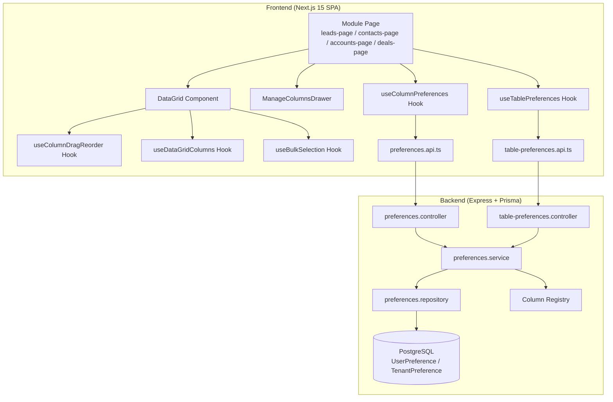
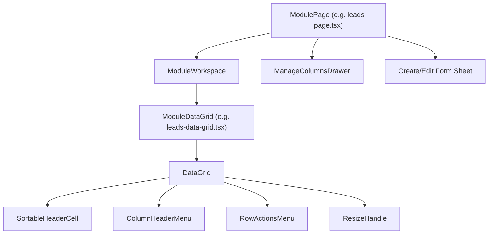
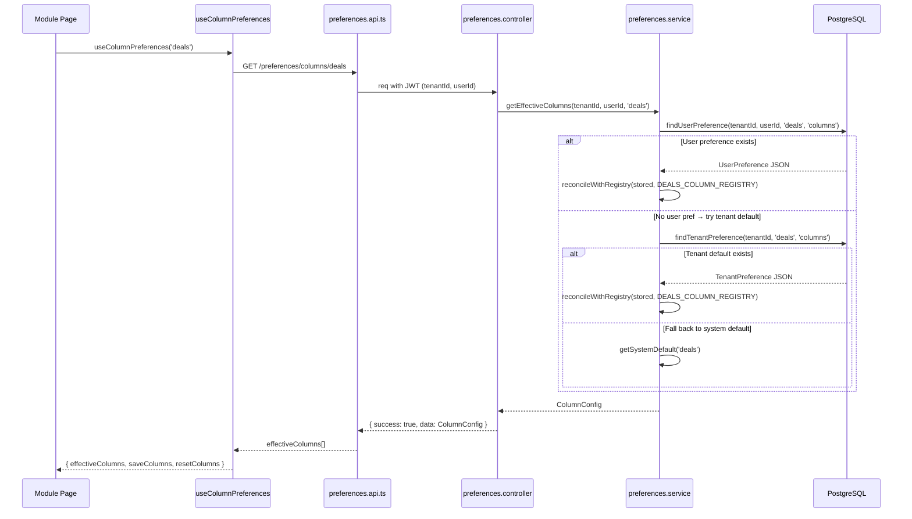

# Design Document: CRM Data View Modernization

## Overview

This design describes the comprehensive audit and modernization of all CRM data views across LeadCRM's five modules (Leads, Contacts, Customers, Accounts, Deals). The scope includes table/list consistency, column management features, form reconciliation, relationship UX, responsive behavior, and the full Deals module migration to the shared DataGrid.

The architecture follows a **single shared component** strategy: one `DataGrid` component, one column preference system, one table preference system — all modules consume these through consistent hook interfaces. No new infrastructure is created; the existing infrastructure is enhanced and all five modules are migrated to use it uniformly.

### Design Rationale

- **Shared-first**: All table behavior lives in `DataGrid` and its hooks. Module-specific code is limited to cell renderers and config objects.
- **Server-authoritative preferences**: Column visibility, order, width, sort, page size, and view mode persist through the centralized `UserPreference` model.
- **Incremental migration**: Each module can be migrated independently. The Deals module is the last to receive the DataGrid treatment.
- **Zero new models/routes**: All changes reuse existing `UserPreference`, `TenantPreference`, column-registry, and table-preferences infrastructure.

## Architecture

### High-Level System Diagram



### Component Hierarchy (Per Module)



### Data Flow: Preference Resolution



## Components and Interfaces

### 1. DataGrid<T> (Enhanced)

**Path:** `frontend/src/shared/components/data-grid/data-grid.tsx`

Enhanced capabilities (additions to existing):
- **Responsive column hiding**: New `useResponsiveColumns` internal hook using `ResizeObserver` on container, hides columns by `priority` field when container width is insufficient.
- **Tooltip on truncated cells**: 500ms hover delay tooltip for `clip` mode.
- **Hidden columns indicator**: Badge showing count of auto-hidden columns.
- **Column width persistence**: `onColumnResize` fires on pointer-up, persists via `saveColumns()`.

```typescript
interface DataGridProps<T> {
  // Existing props preserved...
  columns: DataGridColumnDef<T>[];
  data: T[];
  getRowId: (row: T) => string;
  height?: number | string | 'auto';
  dense?: boolean;
  isLoading?: boolean;
  emptyMessage?: string;
  sort?: SortState | null;
  onSortChange?: (sort: SortState | null) => void;
  selectable?: boolean;
  selectedIds?: Set<string>;
  onSelectionChange?: (ids: Set<string>) => void;
  onRowClick?: (row: T) => void;
  quickActions?: QuickAction<T>[];
  summaryLabel?: string;
  enableColumnMenu?: boolean;
  onHideColumn?: (columnId: string) => void;
  rowActions?: (row: T) => RowActionItem[];
  onSettingsClick?: () => void;
  viewMode?: 'wrap' | 'clip';
  onColumnReorder?: (columns: ColumnConfigItem[]) => void;
  effectiveColumns?: ColumnConfigItem[];
  lockedColumns?: string[];
  // New/enhanced props:
  onColumnWidthChange?: (columnId: string, width: number) => void;
  emptyState?: EmptyStateConfig;
  ariaLabel?: string;
}

interface EmptyStateConfig {
  variant: 'filtered' | 'empty-module' | 'default';
  title?: string;
  description?: string;
  onClearFilters?: () => void;
  onCreateRecord?: () => void;
  canCreate?: boolean;
  createLabel?: string;
}
```

### 2. Module DataGrid Components

Each module has a typed wrapper component:

| Module | Component | Primary Column | Accent Color |
|--------|-----------|---------------|--------------|
| Leads | `leads-data-grid.tsx` | `firstName` | `bg-blue-500` |
| Contacts | `contacts-data-grid.tsx` | `firstName` | `bg-teal-500` |
| Accounts | `accounts-data-grid.tsx` | `name` | `bg-amber-500` |
| Deals | `deals-data-grid.tsx` (NEW) | `title` | `bg-indigo-500` |

### 3. Deals DataGrid (New Component)

**Path:** `frontend/src/features/tenant/crm/deals/ui/deals-data-grid.tsx`

Follows the exact same architecture as `leads-data-grid.tsx`:
- Typed props interface with `Deal` generic
- Cell renderers via `useMemo` (title with avatar, value with currency formatting, stage badge, priority badge, account link, date formatting)
- Column config via `useDataGridColumns` with `DEALS_COLUMN_REGISTRY`
- Row actions via `buildDefaultRowActions` (View, Edit, Delete — RBAC-gated)
- Integration with `useColumnPreferences('deals')` and `useTablePreferences('deals')`

### 4. Relationship Combobox Components

**Path:** `frontend/src/shared/components/entity-combobox.tsx`

A reusable searchable combobox for CRM entity selection:

```typescript
interface EntityComboboxProps {
  /** Entity type for data fetching */
  entityType: 'accounts' | 'contacts' | 'users' | 'pipelines' | 'stages';
  /** Current selected value (ID) */
  value: string | null;
  /** Change handler */
  onChange: (id: string | null) => void;
  /** Multi-select mode */
  multiple?: boolean;
  /** Selected values for multi-select */
  values?: string[];
  onMultiChange?: (ids: string[]) => void;
  /** Placeholder text */
  placeholder?: string;
  /** Minimum characters before search triggers */
  minSearchChars?: number;
  /** Debounce delay in ms */
  debounceMs?: number;
  /** Error state */
  error?: string;
  /** Disabled state */
  disabled?: boolean;
}
```

### 5. Responsive Column Strategy

**Internal hook:** `useResponsiveColumns` (inside DataGrid)

```typescript
interface UseResponsiveColumnsOptions {
  columns: DataGridColumnDef<T>[];
  containerRef: RefObject<HTMLDivElement>;
  fixedWidths: { checkbox: number; actions: number; scrollbar: number };
  enabled: boolean;
}

interface UseResponsiveColumnsReturn {
  visibleColumns: DataGridColumnDef<T>[];
  hiddenCount: number;
}
```

Algorithm:
1. Measure container width via `ResizeObserver` (debounced 200ms)
2. Subtract fixed widths (checkbox 44px, actions 100px, scrollbar 17px, settings 36px)
3. Always include `priority: 'required'` columns
4. Add columns in priority order: `high` → `medium` → `low`
5. Stop adding when available width is exhausted
6. If required columns alone exceed width → enable horizontal scroll

### 6. Form Components (Audited)

Each module's Create/Edit form will be reconciled against its backend Zod schema:

| Module | Create Schema | Edit Schema | Form Component |
|--------|--------------|-------------|----------------|
| Leads | `CreateContactSchema` | `UpdateContactSchema` | `lead-form.tsx` |
| Contacts | `CreateContactSchema` | `UpdateContactSchema` | `contact-form.tsx` |
| Accounts | `CreateCompanySchema` | `UpdateCompanySchema` | `account-form.tsx` |
| Deals | `CreateDealSchema` | `UpdateDealSchema` | `deal-form.tsx` |

All forms use `react-hook-form` + `zodResolver` with the shared schema from the backend DTOs.

## Data Models

### Existing Models (No Changes)

```prisma
model UserPreference {
  id        String   @id @default(cuid())
  tenantId  String
  userId    String
  module    String
  key       String   // "columns" | "pageSize" | "viewMode" | "sort" | "viewType" | "filters"
  value     Json
  createdAt DateTime @default(now())
  updatedAt DateTime @updatedAt

  @@unique([tenantId, userId, module, key])
  @@index([tenantId, userId, module])
}

model TenantPreference {
  id        String   @id @default(cuid())
  tenantId  String
  module    String
  key       String
  value     Json
  createdAt DateTime @default(now())
  updatedAt DateTime @updatedAt

  @@unique([tenantId, module, key])
  @@index([tenantId, module])
}
```

### Shared Types (Existing — `shared/src/types/preferences.ts`)

```typescript
interface ColumnConfigItem {
  id: string;
  visible: boolean;
  order: number;
  width?: number;  // Persisted column width
}

interface ColumnDefinition {
  id: string;
  label: string;
  required: boolean;
  defaultVisible: boolean;
  defaultOrder: number;
  group?: string;
  priority: 'required' | 'high' | 'medium' | 'low';
}
```

### Column Registry Per Module

| Module | Total Columns | Required | Default Visible |
|--------|--------------|----------|-----------------|
| Leads | 78 | 2 (firstName, status) | 7 |
| Contacts | 10 | 2 (firstName, lastName) | 8 |
| Accounts | 10 | 1 (name) | 7 |
| Deals | 10 | 1 (title) | 7 |

### Preference Keys Per Module

| Key | Value Shape | Persistence Trigger |
|-----|------------|-------------------|
| `columns` | `{ columns: ColumnConfigItem[] }` | ManageColumnsDrawer Save, column hide, column reorder, column resize |
| `pageSize` | `{ pageSize: number }` | Page size selector change |
| `viewMode` | `{ viewMode: 'wrap' \| 'clip' }` | View mode toggle |
| `sort` | `{ field: string, direction: 'asc' \| 'desc' }` | Column header sort click |
| `viewType` | `{ viewType: string }` | View type switch (table/list/kanban/tile) |
| `filters` | `{ conditions: FilterCondition[] }` | Filter change |


## Correctness Properties

*A property is a characteristic or behavior that should hold true across all valid executions of a system — essentially, a formal statement about what the system should do. Properties serve as the bridge between human-readable specifications and machine-verifiable correctness guarantees.*

### Property 1: Column Width Clamping Invariant

*For any* resize operation producing a width value (including values below 80, between 80-800, or above 800), the effective column width stored and rendered SHALL always be within the range [80, 800] inclusive.

**Validates: Requirements 2.1, 2.4, 2.5**

### Property 2: Default Width Initialization

*For any* module configuration containing a `defaultWidths` map with N entries, when the DataGrid renders without user-saved column widths, every column referenced in `defaultWidths` SHALL have its rendered width equal to the mapped value, and all other columns SHALL render at the fallback width of 180px.

**Validates: Requirements 2.2**

### Property 3: Reorder Produces Sequential Order Values

*For any* array of N columns after a drag-and-drop reorder operation, the resulting `order` values SHALL be exactly the set {0, 1, 2, ..., N-1} with no gaps, no duplicates, and strictly ascending based on the new visual position.

**Validates: Requirements 4.2**

### Property 4: Column Search Filtering

*For any* column registry of N columns and any search string S, the ManageColumnsDrawer filter SHALL return exactly those columns whose `label` field contains S as a case-insensitive substring, and no others.

**Validates: Requirements 5.1**

### Property 5: Required Columns Cannot Be Hidden

*For any* column marked `required: true` in the Column Registry, the system SHALL never allow that column's `visible` property to be set to `false` — regardless of whether the hide request comes from the column header menu, the ManageColumnsDrawer, or the responsive column strategy.

**Validates: Requirements 5.5, 7.2**

### Property 6: Null/Empty Values Render Em-Dash

*For any* cell value that is `null`, `undefined`, or an empty string, and for any column without a custom cell renderer, the DataGrid SHALL render the em-dash character "—" as the cell content.

**Validates: Requirements 6.6, 13.6**

### Property 7: Date Formatting Consistency

*For any* valid Date object provided to a date-type cell renderer, the formatted output SHALL match the pattern produced by `toLocaleDateString('en-US', { month: 'short', day: 'numeric', year: 'numeric' })` — specifically "MMM D, YYYY" or "MMM DD, YYYY" format.

**Validates: Requirements 6.5, 19.3**

### Property 8: Responsive Column Priority Hiding

*For any* set of columns with assigned priorities and any container width W, the set of hidden columns SHALL satisfy: (1) all `priority: 'required'` columns are always visible, (2) if any columns are hidden, they are the lowest-priority columns that would cause total width to exceed W, (3) columns are hidden in order `low` → `medium` → `high`, and (4) if required columns alone exceed W, horizontal scrolling is enabled rather than hiding any column.

**Validates: Requirements 7.1, 7.2, 7.4**

### Property 9: Page Size Validation

*For any* page size value submitted to the system, the system SHALL accept it if and only if it is a member of the set {10, 20, 25, 30, 40, 50}. All other values SHALL be rejected.

**Validates: Requirements 8.4**

### Property 10: Search Filtering Correctness

*For any* dataset of records and any non-empty search term (after debounce), the filtered result set SHALL contain exactly those records where at least one searchable text field (name, email, phone, or equivalent) contains the search term as a case-insensitive substring.

**Validates: Requirements 8.6**

### Property 11: Form Validation Rejects Invalid Input

*For any* form input value that violates the corresponding Zod schema constraint (min length, max length, email format, enum membership, numeric range), the form SHALL reject submission and display an inline error message within 200ms of blur or submit attempt.

**Validates: Requirements 9.5, 10.5**

### Property 12: Combobox Filtering Correctness

*For any* entity list and any search string of 2+ characters, the combobox dropdown SHALL display only entities whose display name contains the search string (case-insensitive substring match), limited to at most 50 results.

**Validates: Requirements 11.3**

### Property 13: Combobox Stores Entity ID

*For any* entity selected via a relationship combobox (Account or Contact), the form field value stored for submission SHALL be the entity's `id` (string UUID), never the entity's display name or any other non-ID field.

**Validates: Requirements 11.4**

### Property 14: Bulk Selection Cap

*For any* sequence of selection operations (toggle individual rows, select all), the total number of selected records SHALL never exceed 100. Once 100 records are selected, additional select attempts SHALL be rejected without modifying the selection state.

**Validates: Requirements 13.4**

## Error Handling

### Preference Persistence Failures

| Operation | Error Handling |
|-----------|---------------|
| Column save (auto-save from header menu) | Optimistic update → revert on failure → non-blocking error toast (5s auto-dismiss) |
| Column save (ManageColumnsDrawer) | Inline error with Retry button → 3 attempts max → "Close and try again" message |
| Column reset | Optimistic revert → error toast on failure |
| Table preferences (sort/pageSize/viewMode) | Fire-and-forget: apply locally, error toast on failure, retry on next change |
| Column reorder (drag-drop) | Optimistic update → revert to pre-drag state on failure → error toast |

### Form Submission Failures

| Error Type | Handling |
|-----------|----------|
| Validation error (Zod) | Inline field-level error messages, scroll to first error, focus first error field |
| Network error (API unreachable) | Toast notification "Unable to save. Check your connection." + Retry button |
| Server error (500) | Toast notification "Something went wrong. Try again." + Retry button |
| Conflict (409) | Toast notification "Record was modified by another user. Refresh to see changes." |
| Authorization (401/403) | Redirect to login (401) or "You don't have permission" toast (403 shown as 404) |

### Data Loading Failures

| Scenario | Handling |
|----------|----------|
| Column preferences load failure | Fall back to system defaults from Column Registry |
| Table preferences load failure | Fall back to defaults: pageSize=25, viewMode='clip', sort=null |
| Entity list load failure (combobox) | Show error message in dropdown + Retry button |
| Module data load failure | Error boundary with "Something went wrong" + Refresh button |

### Optimistic Update Pattern

```typescript
// Applied consistently across all preference operations
async function optimisticSave<T>(
  localUpdate: () => void,
  apiCall: () => Promise<T>,
  rollback: () => void,
  errorMessage: string
): Promise<void> {
  localUpdate(); // Immediate UI feedback
  try {
    await apiCall();
  } catch (error) {
    rollback();
    toast.error(errorMessage, { duration: 5000 });
  }
}
```

## Testing Strategy

### Dual Testing Approach

This feature uses both unit/integration tests and property-based tests for comprehensive coverage:

- **Unit tests**: Verify specific examples, edge cases, component rendering, and integration points
- **Property tests**: Verify universal properties across all valid inputs using randomized testing
- **Integration tests**: Verify full data flows (frontend → API → backend → DB)
- **E2E tests**: Verify critical user journeys across the 5 modules

### Property-Based Testing Configuration

- **Library**: `fast-check` (already in devDependencies)
- **Minimum iterations**: 100 per property test
- **Tag format**: `Feature: crm-data-view-modernization, Property {number}: {property_text}`

### Test Organization

```
frontend/src/shared/components/data-grid/
├── __tests__/
│   ├── data-grid.test.tsx           Unit tests for DataGrid rendering
│   ├── data-grid.properties.test.ts Property tests for DataGrid logic
│   ├── use-column-resize.test.ts    Unit test for resize hook
│   ├── use-bulk-selection.test.ts   Unit test for selection hook
│   └── use-responsive-columns.test.ts Unit test for responsive hook

frontend/src/shared/hooks/
├── __tests__/
│   ├── use-column-preferences.test.ts  Integration tests
│   └── use-table-preferences.test.ts   Integration tests

frontend/src/shared/components/
├── __tests__/
│   ├── manage-columns-drawer.test.tsx  Unit + property tests
│   └── entity-combobox.test.tsx        Unit + property tests

frontend/src/features/tenant/crm/deals/
├── __tests__/
│   ├── deals-data-grid.test.tsx    Unit tests
│   └── deal-form.test.tsx          Unit + property tests (validation)

backend/src/modules/preferences/
├── __tests__/
│   ├── table-preferences.controller.test.ts  Integration tests
│   ├── column-registry.test.ts               Property tests (reconciliation)
│   └── preferences.service.test.ts           Unit tests
```

### Property Test Implementation Plan

Each correctness property maps to a single `fast-check` property test:

| Property | Test File | Generator Strategy |
|----------|-----------|-------------------|
| 1. Width clamping | `data-grid.properties.test.ts` | `fc.integer()` for arbitrary widths |
| 2. Default widths | `data-grid.properties.test.ts` | `fc.record()` of columnId → width |
| 3. Sequential reorder | `data-grid.properties.test.ts` | `fc.shuffledSubarray()` for column permutations |
| 4. Column search | `manage-columns-drawer.test.tsx` | `fc.array(fc.record())` for registries + `fc.string()` for search |
| 5. Required not hidden | `data-grid.properties.test.ts` | `fc.array()` of columns with random required states |
| 6. Null em-dash | `data-grid.properties.test.ts` | `fc.oneof(fc.constant(null), fc.constant(undefined), fc.constant(''))` |
| 7. Date formatting | `data-grid.properties.test.ts` | `fc.date()` for random dates |
| 8. Responsive priority | `use-responsive-columns.test.ts` | `fc.array()` of columns with priorities + `fc.integer()` for width |
| 9. Page size validation | `table-preferences.controller.test.ts` | `fc.integer()` for arbitrary values |
| 10. Search filtering | `data-grid.properties.test.ts` | `fc.array(fc.record())` for data + `fc.string()` for terms |
| 11. Form validation | `deal-form.test.tsx` | `fc.record()` with constraint-violating values |
| 12. Combobox filtering | `entity-combobox.test.tsx` | `fc.array(fc.record())` for entities + `fc.string({minLength: 2})` |
| 13. Combobox ID storage | `entity-combobox.test.tsx` | `fc.record({id: fc.uuid(), name: fc.string()})` |
| 14. Selection cap | `use-bulk-selection.test.ts` | `fc.array(fc.uuid())` with length > 100 |

### Unit Test Coverage Targets

| Area | Target | Focus |
|------|--------|-------|
| DataGrid component | Key rendering paths | Empty state variants, column rendering, selection UI |
| Column hooks | Core logic | Width clamping, sort cycling, drag reorder |
| Preference hooks | API integration | Success/failure paths, fallback behavior |
| Form components | Validation | All Zod constraints, field presence/absence |
| Module data grids | Configuration | Correct props passed to DataGrid, cell renderers |

### Integration Test Targets

| Flow | Test |
|------|------|
| Column preference round-trip | Save columns → reload → verify same state |
| Table preference persistence | Change sort → reload → verify persisted |
| Deals DataGrid full flow | Render → sort → select → reorder → verify |
| Form submission | Fill form → submit → verify API payload matches schema |
| RBAC guard rendering | User without permission → verify buttons not rendered |

### E2E Test Scenarios (Playwright)

1. **Cross-module consistency**: Visit each module, verify identical toolbar layout
2. **Column management flow**: Open drawer → reorder → hide → save → verify persistence
3. **Deals migration**: Switch to table view → sort → filter → verify data grid renders
4. **Responsive behavior**: Resize viewport → verify columns hide by priority
5. **Form-schema correctness**: Open Deal create form → fill all fields → submit → verify success
