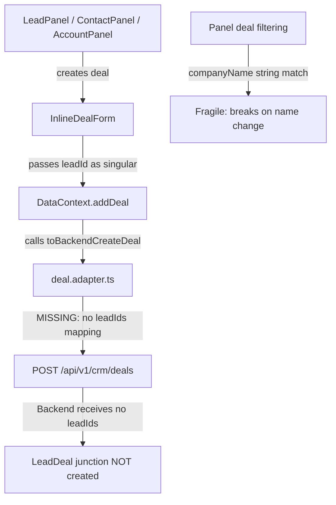
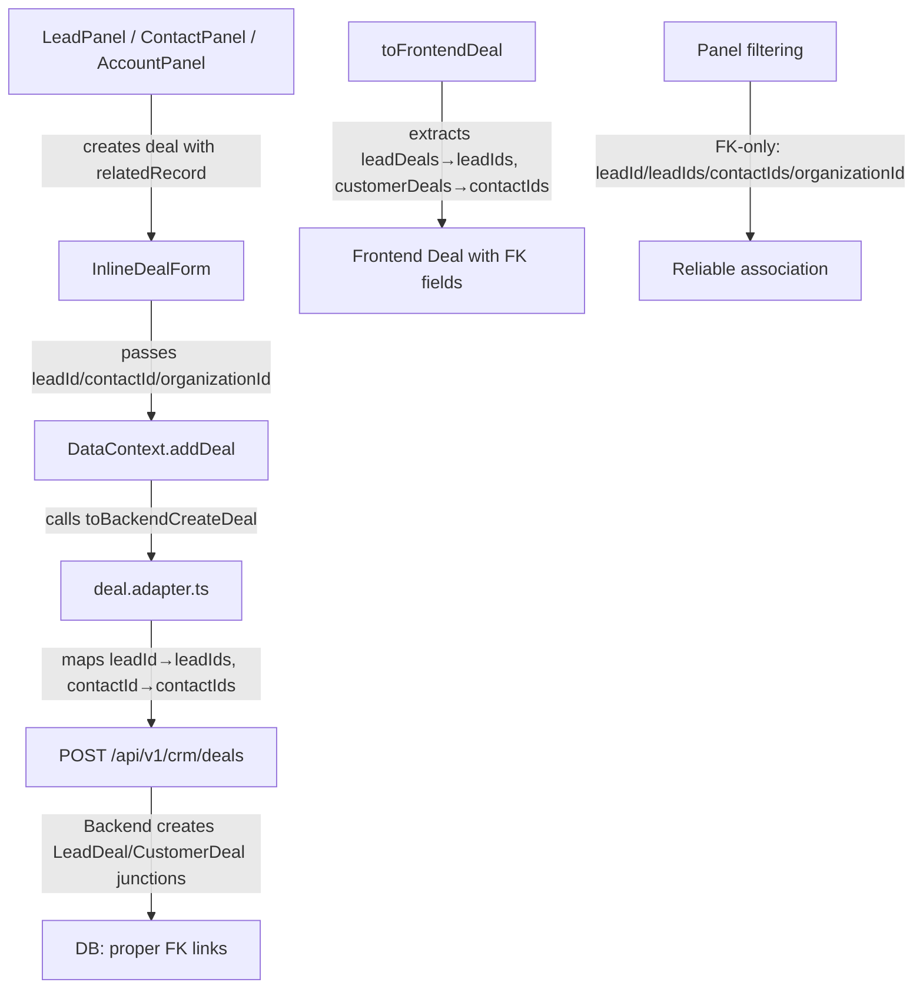

# Design Document: Deal Linkage & Unified CRUD

## Overview

This feature fixes the deal linkage plumbing in LeadCRM so that deals created from any panel (Lead, Contact, Account) use proper FK-based associations instead of fragile `companyName` string matching. The changes are entirely on the **frontend adapter and filtering layers** — the backend already supports junction tables (`LeadDeal`, `CustomerDeal`) and the `organizationId` FK.

The scope covers:
1. Fix `deal.adapter.ts` — properly map `leadId` → `leadIds[]`, extract junction data in `toFrontendDeal`
2. Fix panel filtering — remove `companyName` fallbacks, use FK-only filtering
3. Improve `InlineDealForm` UX — smart defaults, auto-select pipeline/stage
4. Add deal click → DealPanel navigation from all record panels
5. Verify existing DataContext real-time sync (no changes needed)

**Backend: No changes required.** The repository already handles `leadIds` → `LeadDeal` junction creation and returns junction data in responses.

## Architecture

### Current Flow (Broken)



### Target Flow (Fixed)



### Affected Files

| File | Change Type | Description |
|------|-------------|-------------|
| `frontend/src/lib/api/adapters/deal.adapter.ts` | Modify | Fix `toBackendCreateDeal` and `toFrontendDeal` mappings |
| `frontend/src/shared/components/crm/RecordPanelWrappers.tsx` | Modify | Fix deal filtering, add deal click → DealPanel |
| `frontend/src/shared/components/crm/inline-deal-form.tsx` | Modify | Smart defaults (auto-select pipeline/stage, +30d close date) |
| `frontend/src/store/types/deal.types.ts` | No change | Already has `leadId?`, `leadIds?` — verified |
| `shared/src/types/deal.types.ts` | No change | Already has `contactIds?` — verified |
| `backend/src/modules/crm/deals/*` | No change | Already handles junction creation |

## Components and Interfaces

### 1. Deal Adapter (`deal.adapter.ts`)

#### `toBackendCreateDeal(data)` — Updated Logic

```typescript
export function toBackendCreateDeal(data: Partial<any>): any {
  // Normalize leadIds: merge singular leadId into leadIds array, deduplicate
  let leadIds: string[] | undefined;
  if (data.leadIds && data.leadIds.length > 0) {
    leadIds = [...new Set([...(data.leadId ? [data.leadId] : []), ...data.leadIds])];
  } else if (data.leadId) {
    leadIds = [data.leadId];
  }
  // If leadIds is empty/undefined, omit entirely (never send null/undefined)

  // Normalize contactIds: merge singular contactId into contactIds array
  let contactIds: string[] | undefined;
  if (data.contactIds && data.contactIds.length > 0) {
    contactIds = [...new Set([...(data.contactId ? [data.contactId] : []), ...data.contactIds])];
  } else if (data.contactId) {
    contactIds = [data.contactId];
  }

  const result: any = {
    pipelineId: data.pipelineId || '',
    stageId: data.stageId || '',
    title: data.title || 'Untitled Deal',
    value: typeof data.value === 'number' ? data.value : undefined,
    currency: 'PHP',
    priority: toBackendPriority(data.priority),
    expectedCloseDate: toISODatetime(data.expectedCloseDate),
    description: data.description || undefined,
    leadSource: data.leadSource || undefined,
    organizationId: data.companyId || data.organizationId || undefined,
    assignedUserId: data.assignedUserId || undefined,
  };

  // Only include arrays if they have values — never send undefined/null
  if (leadIds && leadIds.length > 0) result.leadIds = leadIds;
  if (contactIds && contactIds.length > 0) result.contactIds = contactIds;

  return result;
}
```

**Key decisions:**
- `leadId` (singular) → merged into `leadIds[]` with deduplication
- `contactId` (singular) → merged into `contactIds[]` with deduplication
- `organizationId` resolved from `companyId || organizationId` (existing behavior, preserved)
- Arrays omitted entirely when empty (never `undefined` or `null` values in payload)

#### `toFrontendDeal(backendDeal)` — Updated Logic

```typescript
// Add leadIds extraction from leadDeals junction
let leadIds: string[] = [];
let leadId: string | undefined;
let leadPerson: { id: string; firstName: string; lastName: string } | undefined;

if (backendDeal.leadDeals && Array.isArray(backendDeal.leadDeals)) {
  leadIds = backendDeal.leadDeals
    .map((ld: any) => ld?.lead?.id || ld?.leadId)
    .filter(Boolean);
  leadId = leadIds[0] || undefined;
  
  const firstLead = backendDeal.leadDeals[0]?.lead;
  if (firstLead) {
    leadPerson = {
      id: firstLead.id,
      firstName: firstLead.firstName || '',
      lastName: firstLead.lastName || '',
    };
  }
}

// Fix contactIds extraction: handle both contactDeals and customerDeals naming
if (backendDeal.contactDeals && Array.isArray(backendDeal.contactDeals)) {
  contactIds = backendDeal.contactDeals
    .map((cd: any) => cd?.contact?.id || cd?.customerId)
    .filter(Boolean);
} else if (backendDeal.customerDeals && Array.isArray(backendDeal.customerDeals)) {
  contactIds = backendDeal.customerDeals
    .map((cd: any) => cd?.customer?.id || cd?.customerId)
    .filter(Boolean);
}
```

**Key decisions:**
- Extract `leadIds` from `backendDeal.leadDeals[].lead.id` (the backend already includes this)
- Set `leadId = leadIds[0]` for backward compatibility with singular FK
- Populate `leadPerson` from first lead in junction for display
- Handle both `contactDeals` and `customerDeals` naming (backend may use either)
- Set `organizationId` from `backendDeal.organizationId || backendDeal.organization?.id`

### 2. Panel Filtering (`RecordPanelWrappers.tsx`)

#### LeadPanel Filter

```typescript
// Before (fragile):
const leadDeals = deals.filter(
  (d: Deal) => d.leadId === lead.id || (lead.companyName && d.companyName === lead.companyName)
);

// After (FK-only):
const leadDeals = deals.filter(
  (d: Deal) => d.leadId === lead.id || (d.leadIds ?? []).includes(lead.id)
);
```

#### ContactPanel Filter

```typescript
// Before:
const contactDeals = deals.filter((d) => d.contactId === contact.id || d.leadId === contact.id);

// After (FK-only):
const contactDeals = deals.filter(
  (d: Deal) => (d.contactIds ?? []).includes(contact.id) || d.contactId === contact.id
);
```

#### AccountPanel Filter

```typescript
// Before (fragile):
const relatedDeals = deals.filter((d) => d.organizationId === account.id || d.companyName === accountName);

// After (FK-only):
const relatedDeals = deals.filter((d: Deal) => d.organizationId === account.id);
```

**Key decision:** All `companyName` string matching is removed. Deals are associated purely via FK fields populated by the corrected `toFrontendDeal` adapter.

### 3. Deal Click → DealPanel Navigation

Each panel (Lead, Contact, Account) adds:
- A `selectedDealId` state variable
- Click handler on deal list items that sets `selectedDealId`
- A `<DealPanel>` overlay rendered when `selectedDealId` is set
- On DealPanel close or save, `selectedDealId` is cleared

```typescript
// In LeadPanel:
const [selectedDealId, setSelectedDealId] = useState<string | null>(null);
const selectedDeal = selectedDealId ? deals.find(d => d.id === selectedDealId) : null;

// In deal list rendering:
<div onClick={() => setSelectedDealId(deal.id)} className="cursor-pointer">
  {deal.title}
</div>

// DealPanel overlay:
{selectedDeal && (
  <DealPanel
    open={!!selectedDeal}
    onOpenChange={(open) => !open && setSelectedDealId(null)}
    deal={selectedDeal}
  />
)}
```

### 4. InlineDealForm UX Improvements

#### Auto-Select First Pipeline + Stage

```typescript
// In useForm defaultValues, compute from pipelines:
const defaultPipeline = pipelines[0];
const defaultStage = defaultPipeline?.stages?.[0];

defaultValues: {
  pipelineId: defaultPipeline?.id || '',
  stageId: defaultStage?.id || '',
  expectedCloseDate: getDatePlusDays(30), // helper: today + 30 days
  confidence: 50,
}
```

#### Default Expected Close Date

```typescript
function getDatePlusDays(days: number): string {
  const date = new Date();
  date.setDate(date.getDate() + days);
  return date.toISOString().split('T')[0]; // "YYYY-MM-DD"
}
```

#### Post-Submit Behavior

On successful submit:
1. Call `reset()` on the form (react-hook-form)
2. Call `onCancel?.()` to collapse the form
3. Display `toast.success('Deal created successfully')`

### 5. DataContext Real-Time Sync (Verified — No Changes)

The existing `DataContext.addDeal` already:
1. Calls `toBackendCreateDeal(dealData)` to transform the payload
2. Sends the API request via `pipelineService.createDeal(dto)`
3. Calls `toFrontendDeal(response.data)` to normalize the response
4. Appends to `setDeals(prev => [deal, ...prev])` — triggers re-render for all consumers

All panels that consume `deals` from `useData()` will automatically see the new deal after state update. No additional work required.

## Data Models

### Frontend Deal Type (Already Correct)

```typescript
// frontend/src/store/types/deal.types.ts — already has these fields:
export interface Deal extends Omit<SharedDeal, 'priority' | 'value' | 'order'> {
  // ... existing fields ...
  leadId?: string;        // FK to primary lead (first in junction)
  leadIds?: string[];     // All leads linked via LeadDeal junction
  contactIds?: string[];  // All contacts linked via CustomerDeal junction (from shared)
  organizationId?: string; // FK to account/organization (from shared)
  leadPerson?: { id: string; firstName: string; lastName: string };
}
```

### Backend DTO (No Change)

```typescript
// CreateDealSchema already accepts contactIds.
// leadIds is passed through outside the schema (destructured in repository).
// No backend changes needed.
```

### Backend Repository Response Shape

```typescript
// findDealById and findAllDeals already include:
leadDeals: {
  include: { lead: { select: { id, firstName, lastName, email, phone } } }
}
// This is what toFrontendDeal will extract leadIds from.
```

**Note:** The backend `findAllDeals` does NOT currently include `customerDeals` in the response. If contact linkage display is needed in list views, a follow-up enhancement to include `customerDeals` in the `findAllDeals` query may be needed. For MVP, `findDealById` (used for detail views) already returns full junction data.

## Correctness Properties

*A property is a characteristic or behavior that should hold true across all valid executions of a system — essentially, a formal statement about what the system should do. Properties serve as the bridge between human-readable specifications and machine-verifiable correctness guarantees.*

### Property 1: leadId normalization in toBackendCreateDeal

*For any* valid input object with a non-empty `leadId` string and/or a non-empty `leadIds` array, `toBackendCreateDeal` SHALL produce an output with a `leadIds` array that contains all unique IDs from both sources, and SHALL NOT contain duplicates.

**Validates: Requirements 2.1, 8.1, 8.2**

### Property 2: contactId normalization in toBackendCreateDeal

*For any* valid input object with a non-empty `contactId` string and/or a non-empty `contactIds` array, `toBackendCreateDeal` SHALL produce an output with a `contactIds` array that contains all unique IDs from both sources, and SHALL NOT contain duplicates.

**Validates: Requirements 3.1, 8.3**

### Property 3: organizationId normalization in toBackendCreateDeal

*For any* valid input object where `companyId` or `organizationId` is a non-empty string, `toBackendCreateDeal` SHALL produce an output with `organizationId` set to that value (preferring `companyId` when both are present).

**Validates: Requirements 2.3, 4.1, 8.4**

### Property 4: Empty array omission in toBackendCreateDeal

*For any* valid input object where neither `leadId` nor `leadIds` is provided (or all are empty), the output of `toBackendCreateDeal` SHALL NOT contain a `leadIds` key. Similarly, if neither `contactId` nor `contactIds` is provided, the output SHALL NOT contain a `contactIds` key.

**Validates: Requirements 8.5**

### Property 5: leadIds round-trip extraction in toFrontendDeal

*For any* backend deal response with a `leadDeals` array of N entries (each containing `lead.id`), `toFrontendDeal` SHALL produce an output where `leadIds` contains exactly those N IDs and `leadId` equals the first entry's ID (or undefined if N = 0).

**Validates: Requirements 2.4, 9.5**

### Property 6: contactIds extraction in toFrontendDeal

*For any* backend deal response with a `contactDeals` or `customerDeals` array of N entries (each containing `contact.id` or `customer.id`), `toFrontendDeal` SHALL produce an output where `contactIds` contains exactly those N IDs.

**Validates: Requirements 3.3, 9.6**

### Property 7: FK-only filtering excludes non-linked deals

*For any* set of deals and a given record (lead, contact, or account), the panel filter function SHALL include a deal if and only if it has a direct FK linkage to that record — deals matched solely by `companyName` string equality SHALL be excluded.

**Validates: Requirements 5.1, 5.2, 5.3, 5.4**

## Error Handling

| Scenario | Handling |
|----------|----------|
| `toBackendCreateDeal` receives no pipeline/stage | Defaults to empty strings — validation fails on backend, error propagates to form |
| API call fails during deal creation | DataContext throws → InlineDealForm catches → toast.error displayed, form state preserved |
| `toFrontendDeal` receives null/undefined | Returns `null` (existing guard preserved) |
| `leadDeals` array contains entries with missing `lead.id` | `.filter(Boolean)` strips invalid entries — graceful degradation |
| Panel filter with deal that has no FK fields | Deal excluded from panel list (correct behavior) |
| InlineDealForm validation fails | react-hook-form shows field-level errors, no API call made |

## Testing Strategy

### Property-Based Tests (vitest + fast-check)

Property-based testing is appropriate here because the adapter functions (`toBackendCreateDeal`, `toFrontendDeal`) are **pure functions** that transform arbitrary input shapes. Generating random deal payloads will exercise edge cases (empty arrays, duplicate IDs, missing fields, mixed singular/plural formats).

**Configuration:** Minimum 100 iterations per property test.

| Property | Test Target | Generator Strategy |
|----------|-------------|-------------------|
| Property 1 | `toBackendCreateDeal` | Random leadId strings + random leadIds arrays (0–5 elements) |
| Property 2 | `toBackendCreateDeal` | Random contactId strings + random contactIds arrays |
| Property 3 | `toBackendCreateDeal` | Random companyId and/or organizationId strings |
| Property 4 | `toBackendCreateDeal` | Inputs with explicitly empty/missing lead/contact fields |
| Property 5 | `toFrontendDeal` | Backend response objects with random leadDeals arrays (0–5 entries) |
| Property 6 | `toFrontendDeal` | Backend response objects with random contactDeals/customerDeals arrays |
| Property 7 | Filter functions | Random deal arrays with varying FK fields + target record |

### Unit Tests (vitest)

- InlineDealForm: default pipeline/stage selection logic
- InlineDealForm: expectedCloseDate defaults to +30 days
- InlineDealForm: form reset and collapse on successful submit
- DealPanel: opens when selectedDealId is set in parent panel
- DataContext.addDeal: integration test verifying end-to-end flow with mocked API

### Integration Tests (manual verification)

- Create deal from LeadPanel → verify appears in Deals module and pipeline board
- Create deal from ContactPanel → verify deal has correct contactIds
- Create deal from AccountPanel → verify organizationId linkage
- Rename an account → verify panel still shows correct deals (FK not affected)
