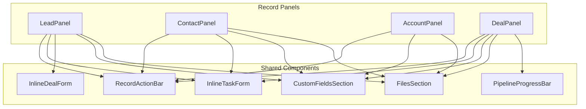

# Design Document: Deals Module Modernization

## Overview

This design covers the production-readiness modernization of the LeadCRM Deals module. The work spans three layers — backend API hardening (error propagation, bulk operations, forecast/velocity endpoints, server-side sort/filter), frontend decomposition (pipeline page split, unified form, error boundaries, RBAC alignment), and cross-cutting concerns (preference migration, currency formatting, junction sync).

The existing architecture is sound: Express + Prisma layered backend with proper tenant scoping, a DataGrid-based frontend with column preferences, and a Kanban pipeline board with @dnd-kit. This effort fills security gaps, adds missing CRM capabilities, and enforces code quality invariants.

### Design Principles

1. **Extend, don't replace** — all changes build on the existing controller → service → repository pattern
2. **Bulk operations are transactional** — each deal within a bulk request is processed independently (partial success), but each individual deal mutation is atomic
3. **Server is truth** — forecast, velocity, and sorting move from client-side computation to server-side endpoints
4. **Progressive enhancement** — pipeline pagination loads initial data fast, then fetches more on scroll

---

## Architecture

### High-Level System Diagram

```mermaid
graph TB
    subgraph Frontend
        DP[Deals Page]
        PP[Pipeline Page]
        DF[Deal Form - Unified]
        EB[Error Boundaries]
    end

    subgraph Backend API Layer
        CR[crm.routes.ts]
        DC[deals.controller.ts]
        BC[bulk.controller.ts]
    end

    subgraph Service Layer
        DS[deals.service.ts]
        BS[bulk-deals.service.ts]
        FS[forecast.service.ts]
        VS[velocity.service.ts]
    end

    subgraph Repository Layer
        DR[deals.repository.ts]
    end

    subgraph Database
        PG[(PostgreSQL)]
    end

    subgraph Cross-Cutting
        AU[Audit Service]
        PR[Preference System]
        CF[Currency Formatter]
    end

    DP --> CR
    PP --> CR
    DF --> CR
    CR --> DC
    CR --> BC
    DC --> DS
    BC --> BS
    DS --> DR
    BS --> DR
    FS --> DR
    VS --> DR
    DR --> PG
    DS --> AU
    BS --> AU
    PP --> PR
    DP --> CF
    PP --> CF
end
```

### Backend Module Structure (Extended)

```
backend/src/modules/crm/deals/
├── deals.controller.ts       (existing — add forecast, velocity, restore, duplicate)
├── deals.service.ts          (existing — add restore, duplicate, error propagation)
├── deals.repository.ts       (existing — fix error handling, add sort/filter, pagination helpers)
├── deals.dto.ts              (existing — add bulk schemas, query schemas, value bounds)
├── deals.types.ts            (existing types)
├── bulk-deals.controller.ts  (NEW — bulk archive, reassign, stage-change endpoints)
├── bulk-deals.service.ts     (NEW — bulk operation orchestration)
├── forecast.service.ts       (NEW — weighted pipeline forecast calculation)
└── velocity.service.ts       (NEW — deal velocity computation from stage history)
```

### Frontend Module Structure (Extended)

```
frontend/src/features/tenant/crm/pipeline/ui/
├── pipeline-page.tsx          (existing — reduced to orchestrator, <800 lines)
├── pipeline-kanban-board.tsx  (NEW — extracted Kanban board)
├── pipeline-deal-card.tsx     (NEW — extracted deal card)
├── pipeline-table-view.tsx    (NEW — extracted table/list view)
├── pipeline-velocity-chart.tsx (NEW — extracted velocity chart)
├── deal-details-modal.tsx     (existing)
├── handoff-modal.tsx          (existing)
└── forecast-bar.tsx           (existing)

frontend/src/features/tenant/crm/deals/ui/
├── deals-page.tsx             (existing — add error boundary)
├── deals-data-grid.tsx        (existing)
├── deal-form.tsx              (existing — unify for both pages)
├── deal-filters.tsx           (existing)
└── deal-form-sheet.tsx        (wrapper for Sheet + DealForm — shared)

frontend/src/shared/utils/
├── currency.ts               (NEW — tenant-aware currency formatter)
```

---

## Components and Interfaces

### Backend: New DTOs (Zod Schemas)

```typescript
// deals.dto.ts — additions

export const DealsQuerySchema = z.object({
  page:           z.coerce.number().int().min(1).default(1),
  limit:          z.coerce.number().int().min(1).max(100).default(25),
  sortBy:         z.enum(['title', 'value', 'priority', 'expectedCloseDate', 'createdAt', 'updatedAt', 'stageId']).optional(),
  sortOrder:      z.enum(['asc', 'desc']).default('desc'),
  search:         z.string().optional(),
  stageId:        z.string().min(1).optional(),
  pipelineId:     z.string().min(1).optional(),
  priority:       z.enum(['LOW', 'MEDIUM', 'HIGH']).optional(),
  assignedUserId: z.string().min(1).optional(),
  dateFrom:       z.string().datetime().optional(),
  dateTo:         z.string().datetime().optional(),
  archived:       z.enum(['true', 'false']).default('false'),
  groupByStage:   z.enum(['true', 'false']).optional(),
});

export const BulkArchiveSchema = z.object({
  dealIds:       z.array(z.string().min(1)).min(1).max(50),
  archiveReason: z.string().optional(),
});

export const BulkReassignSchema = z.object({
  dealIds:        z.array(z.string().min(1)).min(1).max(50),
  assignedUserId: z.string().min(1),
});

export const BulkStageChangeSchema = z.object({
  dealIds:    z.array(z.string().min(1)).min(1).max(50),
  stageId:    z.string().min(1),
  note:       z.string().optional(),
  lostReason: z.string().optional(),
});

// Value bounds (modify existing CreateDealSchema)
// value: z.number().positive().max(999_999_999_999).optional()
```

### Backend: New API Endpoints

| Method | Path | Permission | Description |
|--------|------|-----------|-------------|
| GET | `/crm/deals` | `deals.view` | List with server sort/filter (enhanced) |
| GET | `/crm/deals/forecast` | `deals.view` | Weighted pipeline forecast |
| GET | `/crm/deals/velocity` | `deals.view` | Deal velocity metrics |
| POST | `/crm/deals/:id/duplicate` | `deals.create` | Duplicate a deal |
| PATCH | `/crm/deals/:id/restore` | `deals.edit` | Restore archived deal |
| POST | `/crm/deals/bulk/archive` | `deals.delete` | Bulk archive |
| POST | `/crm/deals/bulk/reassign` | `deals.edit` | Bulk reassign |
| POST | `/crm/deals/bulk/stage` | `deals.edit` | Bulk stage change |

### Backend: Controller Signatures

```typescript
// deals.controller.ts — new exports
export async function getForecast(req: Request, res: Response, next: NextFunction): Promise<void>;
export async function getVelocity(req: Request, res: Response, next: NextFunction): Promise<void>;
export async function duplicateDeal(req: Request, res: Response, next: NextFunction): Promise<void>;
export async function restoreDeal(req: Request, res: Response, next: NextFunction): Promise<void>;

// bulk-deals.controller.ts
export async function bulkArchive(req: Request, res: Response, next: NextFunction): Promise<void>;
export async function bulkReassign(req: Request, res: Response, next: NextFunction): Promise<void>;
export async function bulkStageChange(req: Request, res: Response, next: NextFunction): Promise<void>;
```

### Backend: Service Layer Signatures

```typescript
// deals.service.ts — new exports
export async function restoreDeal(id: string, tenantId: string, userId: string): Promise<Deal>;
export async function duplicateDeal(id: string, tenantId: string, userId: string): Promise<Deal>;

// forecast.service.ts
export interface ForecastResult {
  total: number;
  currency: string;
  byPipeline: Array<{ pipelineId: string; name: string; total: number }>;
}
export async function computeForecast(tenantId: string, pipelineId?: string): Promise<ForecastResult>;

// velocity.service.ts
export interface VelocityStage {
  stageId: string;
  name: string;
  avgMinutes: number;
  dealCount: number;
}
export interface VelocityResult {
  stages: VelocityStage[];
  avgTotalMinutes: number;
}
export async function computeVelocity(
  tenantId: string,
  opts?: { pipelineId?: string; dateFrom?: string; dateTo?: string }
): Promise<VelocityResult>;

// bulk-deals.service.ts
export interface BulkOperationResult {
  succeeded: number;
  failed: number;
  errors: Array<{ id: string; reason: string }>;
}
export async function bulkArchive(tenantId: string, userId: string, dto: BulkArchiveDto): Promise<BulkOperationResult>;
export async function bulkReassign(tenantId: string, userId: string, dto: BulkReassignDto): Promise<BulkOperationResult>;
export async function bulkStageChange(tenantId: string, userId: string, dto: BulkStageChangeDto): Promise<BulkOperationResult>;
```

### Backend: Repository Layer — Error Propagation Fix

```typescript
// deals.repository.ts — pattern for updateDeal and archiveDeal

import { Prisma } from '@prisma/client';

export async function updateDeal(id: string, tenantId: string, dto: UpdateDealDto) {
  const { leadIds: _leadIds, ...updateData } = dto as UpdateDealDto & { leadIds?: string[] };
  try {
    return await prisma.deal.update({ where: { id, tenantId }, data: updateData as never });
  } catch (error) {
    if (error instanceof Prisma.PrismaClientKnownRequestError && error.code === 'P2025') {
      return null; // Record not found
    }
    throw error; // Re-throw all other errors (connection, constraint, etc.)
  }
}

export async function archiveDeal(id: string, tenantId: string, archiveReason?: string) {
  try {
    return await prisma.deal.update({
      where: { id, tenantId },
      data: { isArchived: true, archiveReason: archiveReason ?? null },
    });
  } catch (error) {
    if (error instanceof Prisma.PrismaClientKnownRequestError && error.code === 'P2025') {
      return null;
    }
    throw error; // Connection errors, constraint violations bubble up
  }
}
```

### Backend: Forecast Computation Algorithm

```typescript
// forecast.service.ts — core algorithm
export async function computeForecast(tenantId: string, pipelineId?: string): Promise<ForecastResult> {
  const where: Prisma.DealWhereInput = {
    tenantId,
    isArchived: false,
    stage: { isWon: false, isLost: false },
    ...(pipelineId ? { pipelineId } : {}),
  };

  const deals = await prisma.deal.findMany({
    where,
    select: { value: true, pipelineId: true, stage: { select: { probability: true } }, pipeline: { select: { id: true, name: true } } },
  });

  // Tenant currency lookup
  const tenant = await prisma.tenant.findUnique({ where: { id: tenantId }, select: { currency: true } });
  const currency = tenant?.currency || 'PHP';

  // Compute weighted total
  let total = 0;
  const byPipelineMap = new Map<string, { name: string; total: number }>();

  for (const deal of deals) {
    const weighted = (deal.value ?? 0) * ((deal.stage?.probability ?? 0) / 100);
    total += weighted;

    const entry = byPipelineMap.get(deal.pipelineId) ?? { name: deal.pipeline.name, total: 0 };
    entry.total += weighted;
    byPipelineMap.set(deal.pipelineId, entry);
  }

  const byPipeline = Array.from(byPipelineMap.entries()).map(([pipelineId, v]) => ({
    pipelineId, name: v.name, total: v.total,
  }));

  return { total, currency, byPipeline };
}
```

### Backend: Velocity Computation Algorithm

```typescript
// velocity.service.ts — core algorithm
export async function computeVelocity(
  tenantId: string,
  opts?: { pipelineId?: string; dateFrom?: string; dateTo?: string }
): Promise<VelocityResult> {
  const where: Prisma.DealStageHistoryWhereInput = {
    tenantId,
    timeInPrevStage: { not: null },
    ...(opts?.pipelineId ? { deal: { pipelineId: opts.pipelineId } } : {}),
    ...(opts?.dateFrom || opts?.dateTo ? {
      movedAt: {
        ...(opts?.dateFrom ? { gte: new Date(opts.dateFrom) } : {}),
        ...(opts?.dateTo   ? { lte: new Date(opts.dateTo) }   : {}),
      },
    } : {}),
  };

  // Aggregate: avg timeInPrevStage grouped by previousStageId
  const histories = await prisma.dealStageHistory.findMany({
    where,
    select: {
      previousStageId: true,
      timeInPrevStage: true,
      previousStage: { select: { id: true, name: true } },
    },
  });

  // Group by previousStageId and compute averages
  const stageMap = new Map<string, { name: string; totalMinutes: number; count: number }>();

  for (const h of histories) {
    if (!h.previousStageId || h.timeInPrevStage === null) continue;
    const entry = stageMap.get(h.previousStageId) ?? { name: h.previousStage?.name ?? '', totalMinutes: 0, count: 0 };
    entry.totalMinutes += h.timeInPrevStage;
    entry.count += 1;
    stageMap.set(h.previousStageId, entry);
  }

  const stages: VelocityStage[] = Array.from(stageMap.entries()).map(([stageId, v]) => ({
    stageId,
    name: v.name,
    avgMinutes: Math.round(v.totalMinutes / v.count),
    dealCount: v.count,
  }));

  const totalMinutes = stages.reduce((sum, s) => sum + s.avgMinutes, 0);
  const avgTotalMinutes = stages.length > 0 ? Math.round(totalMinutes / stages.length) : 0;

  return { stages, avgTotalMinutes };
}
```

### Backend: Bulk Operations — Partial Success Pattern

```typescript
// bulk-deals.service.ts — core pattern
export async function bulkArchive(
  tenantId: string, userId: string, dto: BulkArchiveDto
): Promise<BulkOperationResult> {
  const result: BulkOperationResult = { succeeded: 0, failed: 0, errors: [] };

  for (const dealId of dto.dealIds) {
    try {
      // Verify ownership
      const deal = await prisma.deal.findFirst({ where: { id: dealId, tenantId } });
      if (!deal) {
        // Silent skip per security rules (cross-tenant = 404 behavior)
        result.failed += 1;
        result.errors.push({ id: dealId, reason: 'Not found' });
        continue;
      }

      await prisma.deal.update({ where: { id: dealId }, data: { isArchived: true, archiveReason: dto.archiveReason ?? null } });

      await writeAuditLog({
        tenantId, userId,
        action: 'deal.archived', entityType: 'Deal', entityId: dealId,
        after: { isArchived: true, archiveReason: dto.archiveReason, bulk: true },
      });

      result.succeeded += 1;
    } catch (error) {
      result.failed += 1;
      result.errors.push({ id: dealId, reason: 'Internal error' });
    }
  }

  return result;
}
```

### Backend: Junction Table Sync

```typescript
// deals.repository.ts — new function
export async function syncContactAssociations(
  dealId: string, tenantId: string, contactIds: string[], userId: string
): Promise<void> {
  await prisma.$transaction(async (tx) => {
    // Get current associations
    const current = await tx.leadDeal.findMany({
      where: { dealId, tenantId },
      select: { leadId: true },
    });
    const currentIds = new Set(current.map(c => c.leadId));
    const targetIds = new Set(contactIds);

    // Remove associations no longer in the set
    const toRemove = [...currentIds].filter(id => !targetIds.has(id));
    if (toRemove.length > 0) {
      await tx.leadDeal.deleteMany({
        where: { dealId, tenantId, leadId: { in: toRemove } },
      });
    }

    // Add new associations
    const toAdd = [...targetIds].filter(id => !currentIds.has(id));
    if (toAdd.length > 0) {
      // Verify all new contacts belong to tenant
      const validContacts = await tx.lead.findMany({
        where: { id: { in: toAdd }, tenantId },
        select: { id: true },
      });
      const validIds = new Set(validContacts.map(c => c.id));
      const invalidIds = toAdd.filter(id => !validIds.has(id));

      if (invalidIds.length > 0) {
        throw new ValidationError(`Invalid contact IDs: ${invalidIds.join(', ')}`);
      }

      await tx.leadDeal.createMany({
        data: toAdd.map(leadId => ({ leadId, dealId, tenantId, addedById: userId })),
        skipDuplicates: true,
      });
    }
  });
}
```

### Backend: Deal Duplication

```typescript
// deals.service.ts — duplicate logic
export async function duplicateDeal(id: string, tenantId: string, userId: string): Promise<Deal> {
  await enforcePlanLimit(tenantId, 'deals');

  const source = await repo.findDealById(id, tenantId);
  if (!source) throw new NotFoundError('Deal');

  const { id: _id, createdAt: _c, updatedAt: _u, closedAt: _cl, lostReason: _lr, isArchived: _a, deletedAt: _d, ...copyData } = source;

  const newDeal = await prisma.deal.create({
    data: {
      ...copyData,
      title: `${source.title} (Copy)`,
      tenantId,
      ownerId: userId,
      isArchived: false,
      closedAt: null,
      lostReason: null,
    } as never,
  });

  // Copy contact associations
  const associations = await prisma.leadDeal.findMany({ where: { dealId: id, tenantId } });
  if (associations.length > 0) {
    await prisma.leadDeal.createMany({
      data: associations.map(a => ({ leadId: a.leadId, dealId: newDeal.id, tenantId, addedById: userId })),
      skipDuplicates: true,
    });
  }

  await writeAuditLog({
    tenantId, userId,
    action: 'deal.duplicated', entityType: 'Deal', entityId: newDeal.id,
    after: { sourceId: id, title: newDeal.title },
  });

  return newDeal;
}
```

### Frontend: Unified Deal Form Component

```typescript
// features/tenant/crm/deals/ui/deal-form.tsx
interface DealFormProps {
  mode: 'create' | 'edit';
  initialData?: Partial<Deal>;
  /** Pre-fill pipeline/stage when creating from a Kanban column */
  preselect?: { pipelineId?: string; stageId?: string };
  onSubmit: (data: CreateDealRequest | UpdateDealRequest) => Promise<void>;
  onCancel: () => void;
  isLoading?: boolean;
}
```

The form uses `react-hook-form` with the `zodResolver` wired to either `CreateDealSchema` or `UpdateDealSchema` depending on mode. Required fields (`pipelineId`, `stageId`, `title`) disable the submit button until valid.

### Frontend: Pipeline Page Decomposition

```typescript
// pipeline-kanban-board.tsx
interface PipelineKanbanBoardProps {
  pipeline: Pipeline;
  deals: Deal[];
  users: User[];
  canEdit: boolean;
  canDelete: boolean;
  onDealClick: (deal: Deal) => void;
  onDealDragEnd: (dealId: string, newStageId: string) => void;
  onAddDeal: (stageId: string) => void;
  onLoadMore: (stageId: string) => void;
  loadingStages: Set<string>;
  hasMoreByStage: Record<string, boolean>;
}

// pipeline-deal-card.tsx
interface PipelineDealCardProps {
  deal: Deal;
  assignedUser?: User;
  canDrag: boolean;
  isAutomatedOnly: boolean;
  onClick: (deal: Deal) => void;
}

// pipeline-table-view.tsx
interface PipelineTableViewProps {
  deals: Deal[];
  columns: ColumnConfigItem[];
  sort: SortState | null;
  onSortChange: (sort: SortState | null) => void;
  onDealClick: (deal: Deal) => void;
}

// pipeline-velocity-chart.tsx
interface PipelineVelocityChartProps {
  velocityData: VelocityResult | null;
  isLoading: boolean;
}
```

### Frontend: Currency Formatting Utility

```typescript
// shared/utils/currency.ts
interface CurrencyConfig {
  code: string;   // ISO 4217 (e.g. 'PHP', 'USD')
  symbol: string; // Display symbol (e.g. '₱', '$')
}

const CURRENCY_MAP: Record<string, string> = {
  PHP: '₱', USD: '$', EUR: '€', GBP: '£', JPY: '¥',
  SGD: 'S$', AUD: 'A$', CAD: 'C$', INR: '₹', MYR: 'RM',
};

const DEFAULT_CURRENCY: CurrencyConfig = { code: 'PHP', symbol: '₱' };

export function getTenantCurrency(tenant: { currency?: string } | null): CurrencyConfig {
  const code = tenant?.currency || 'PHP';
  const symbol = CURRENCY_MAP[code] || code;
  return { code, symbol };
}

export function formatCurrency(value: number, config: CurrencyConfig = DEFAULT_CURRENCY): string {
  return `${config.symbol}${Math.round(value).toLocaleString('en-PH')}`;
}
```

### Frontend: Error Boundary Component

```typescript
// shared/components/error-boundary.tsx
interface ModuleErrorBoundaryProps {
  children: React.ReactNode;
  fallbackLabel?: string; // e.g. "Kanban Board", "Deals Table"
  onError?: (error: Error, info: React.ErrorInfo) => void;
}

interface ModuleErrorBoundaryState {
  hasError: boolean;
  error: Error | null;
}
```

The error boundary catches rendering errors, logs to console with component stack, and renders a contextual message with a "Retry" button that calls `setState({ hasError: false })` to re-mount children.

---

## Data Models

### Existing Models (No Schema Changes Required)

The Prisma schema already has all necessary models and fields:

- **Deal** — `isArchived`, `archiveReason`, `value`, `currency`, `priority`, `stageId`, `pipelineId`, `assignedUserId`, `expectedCloseDate`, `createdAt`, `updatedAt`
- **Stage** — `probability`, `isWon`, `isLost`, `requiredFields`, `tenantId`
- **DealStageHistory** — `timeInPrevStage`, `previousStageId`, `newStageId`, `movedAt`, `tenantId`
- **LeadDeal** — junction table with `leadId`, `dealId`, `tenantId`, `addedById`
- **Tenant** — `currency` field (already exists or to be added)

### Database Index Verification

Existing indexes cover the primary query patterns:

| Index | Purpose |
|-------|---------|
| `[tenantId, stageId]` | Filter by stage |
| `[tenantId, pipelineId]` | Filter by pipeline |
| `[tenantId, assignedUserId]` | Filter by assigned user |
| `[tenantId, createdAt]` | Sort by creation date |
| `[tenantId, isArchived]` | Archive filter |

**New index needed for date range + sort queries:**

```prisma
@@index([tenantId, expectedCloseDate])
```

This index supports the `dateFrom`/`dateTo` filter on `createdAt` (already indexed) and expected close date filtering.

### Response Envelope Formats

```typescript
// Forecast response
{
  success: true,
  data: {
    total: 4_250_000,
    currency: "PHP",
    byPipeline: [
      { pipelineId: "pip-1", name: "Sales Pipeline", total: 3_500_000 },
      { pipelineId: "pip-2", name: "Enterprise", total: 750_000 }
    ]
  }
}

// Velocity response
{
  success: true,
  data: {
    stages: [
      { stageId: "stg-1", name: "Discovery", avgMinutes: 4320, dealCount: 45 },
      { stageId: "stg-2", name: "Proposal", avgMinutes: 8640, dealCount: 32 }
    ],
    avgTotalMinutes: 6480
  }
}

// Bulk operation response
{
  success: true,
  data: {
    succeeded: 8,
    failed: 2,
    errors: [
      { id: "deal-99", reason: "Not found" },
      { id: "deal-42", reason: "Missing required field: accountId" }
    ]
  }
}

// Grouped-by-stage response (pipeline pagination)
{
  success: true,
  data: {
    stages: [
      { stageId: "stg-1", deals: [...], total: 45, page: 1, hasMore: true },
      { stageId: "stg-2", deals: [...], total: 12, page: 1, hasMore: false }
    ]
  }
}
```

---

## Correctness Properties

*A property is a characteristic or behavior that should hold true across all valid executions of a system — essentially, a formal statement about what the system should do. Properties serve as the bridge between human-readable specifications and machine-verifiable correctness guarantees.*

### Property 1: Repository Error Classification

*For any* Prisma error thrown by a database query, the repository SHALL return `null` if and only if the error code is `P2025` (record not found). For all other error codes, the repository SHALL propagate the error to the caller unchanged.

**Validates: Requirements 1.1, 1.2**

### Property 2: Sort Ordering Correctness

*For any* set of deals and any valid `sortBy` field (`title`, `value`, `priority`, `expectedCloseDate`, `createdAt`, `updatedAt`, `stageId`) with a given `sortOrder` (`asc` or `desc`), the deals returned by the repository SHALL be ordered such that for each consecutive pair `(deal[i], deal[i+1])`, the value of the sort field on `deal[i]` is less than or equal to (for `asc`) or greater than or equal to (for `desc`) the value on `deal[i+1]`.

**Validates: Requirements 4.1, 4.2, 4.3**

### Property 3: Invalid Sort Field Rejection

*For any* string value that is NOT in the set `{title, value, priority, expectedCloseDate, createdAt, updatedAt, stageId}`, when provided as the `sortBy` query parameter, the API SHALL return HTTP 400.

**Validates: Requirements 4.5**

### Property 4: Filter Predicate Invariant

*For any* combination of valid filter parameters (`stageId`, `priority`, `pipelineId`, `assignedUserId`, `dateFrom`, `dateTo`), every deal in the response SHALL satisfy ALL provided filter predicates simultaneously (logical AND).

**Validates: Requirements 5.1, 5.2, 5.3, 5.4, 5.5, 5.6**

### Property 5: Bulk Operation Size Boundary

*For any* bulk operation request (archive, reassign, stage change) with a `dealIds` array of length greater than 50, the API SHALL reject the request with HTTP 400. For arrays of length 1 through 50, the API SHALL process the request.

**Validates: Requirements 6.2, 7.4, 8.6**

### Property 6: Bulk Operation Accounting Invariant

*For any* bulk operation request, the response SHALL satisfy the invariant: `succeeded + failed === dealIds.length`. No deal ID is counted in both, and no deal ID is uncounted.

**Validates: Requirements 6.4**

### Property 7: Bulk Tenant Isolation

*For any* bulk operation where some deal IDs belong to the authenticated tenant and some do not, the operation SHALL process only tenant-owned deals and silently skip (count as failed) non-tenant deals without revealing their existence.

**Validates: Requirements 6.3, 8.5**

### Property 8: Bulk Audit Correspondence

*For any* bulk operation, the number of audit log entries created SHALL equal the `succeeded` count in the response.

**Validates: Requirements 6.5, 7.5**

### Property 9: Forecast Computation Correctness

*For any* set of non-archived, non-won, non-lost deals in a tenant, the forecast total SHALL equal the sum of `deal.value × stage.probability / 100` for each deal in the set. Deals where `value` is null contribute 0 to the sum.

**Validates: Requirements 12.1**

### Property 10: Junction Sync Set Equality

*For any* deal update with a `contactIds` array, after the sync completes, the set of `leadId` values in the `LeadDeal` table for that deal SHALL be exactly equal to the provided `contactIds` set — no extra records, no missing records.

**Validates: Requirements 13.1, 13.2, 13.3, 13.4**

### Property 11: Value Bound Validation

*For any* numeric value greater than 999,999,999,999, the `CreateDealSchema` and `UpdateDealSchema` SHALL reject the input with a validation error. For any positive value less than or equal to 999,999,999,999, the schema SHALL accept it.

**Validates: Requirements 14.1, 14.2, 14.3**

### Property 12: Currency Format Consistency

*For any* tenant currency configuration (or absence thereof), the `formatCurrency` utility SHALL use the tenant's configured symbol. When no configuration exists, it SHALL fall back to `₱` (Philippine Peso).

**Validates: Requirements 15.2, 15.3**

### Property 13: Deal Duplication Field Preservation

*For any* deal, the duplicated deal SHALL have identical values for all fields except `id`, `createdAt`, `updatedAt`, `closedAt`, `lostReason`, `isArchived`, and `ownerId`. The duplicated deal's `title` SHALL equal the source title suffixed with ` (Copy)`.

**Validates: Requirements 16.1, 16.2, 16.3**

### Property 14: Velocity Average Correctness

*For any* set of `DealStageHistory` records within the query window, the average time-in-stage for each stage SHALL equal the arithmetic mean of `timeInPrevStage` values for records with that `previousStageId`.

**Validates: Requirements 19.1, 19.4**

### Property 15: Pipeline Pagination Metadata Correctness

*For any* stage with `N` total deals and a page size of 20, `hasMore` SHALL be `true` if and only if `N > page × 20`. The `total` field SHALL always equal the actual count of deals in that stage.

**Validates: Requirements 17.3, 17.4**

### Property 16: Restore Precondition

*For any* deal that is NOT currently archived, the restore endpoint SHALL return HTTP 400. For any deal that IS archived, the restore SHALL set `isArchived` to `false` and `archiveReason` to `null`.

**Validates: Requirements 9.1, 9.3**

---

## Error Handling

### Backend Error Strategy

| Layer | Error Type | Behavior |
|-------|-----------|----------|
| Repository | `P2025` (not found) | Return `null` |
| Repository | Constraint violation | Re-throw as-is |
| Repository | Connection error | Re-throw as-is |
| Service | `null` from repo | Throw `NotFoundError` (404) |
| Service | Constraint violation | Throw `ConflictError` (409) or `ValidationError` (400) |
| Service | Connection/infra error | Let propagate to global handler (500) |
| Controller | Any error | `next(err)` to global error middleware |
| Global middleware | `AppError` subclass | Use `error.statusCode` |
| Global middleware | Unknown error | 500 + generic message + log actual error |

### Frontend Error Strategy

| Scenario | Handling |
|----------|----------|
| Network failure on mutation | Toast with error message + retry option |
| Rendering error in DataGrid | Error boundary with "Retry" button |
| Rendering error in Kanban | Error boundary with "Retry" button |
| Bulk operation partial failure | Success toast with summary ("8 archived, 2 failed") |
| 401 response | Redirect to login page |
| 403 response | Toast "Access denied" |
| 404 response | Toast "Record not found" + remove from local state |

### Error Boundary Placement

```
DealsPage
├── ErrorBoundary("Deals Table")
│   └── DealsDataGrid
└── ErrorBoundary("Pagination")
    └── Pagination

PipelinePage
├── ErrorBoundary("Kanban Board")
│   └── PipelineKanbanBoard
├── ErrorBoundary("Table View")
│   └── PipelineTableView
└── ErrorBoundary("Velocity Chart")
    └── PipelineVelocityChart
```

---

## Testing Strategy

### Property-Based Testing (vitest + fast-check)

Property-based testing is applicable to this feature because the deals module has pure computation logic (forecast, velocity, sort/filter predicates, junction sync, value validation) with clear input/output behavior where input variation reveals edge cases.

**Library**: `fast-check` (already in project dependencies)
**Minimum iterations**: 100 per property test
**Tag format**: `Feature: deals-module-modernization, Property N: <description>`

Properties to implement as PBT:
- Property 1: Repository error classification (mock Prisma errors with arbitrary codes)
- Property 2: Sort ordering correctness (generate random deal arrays, verify ordering)
- Property 4: Filter predicate invariant (generate random deals + filter combos)
- Property 5: Bulk operation size boundary (generate arrays of size 1-100)
- Property 6: Bulk operation accounting invariant (verify succeeded + failed = input.length)
- Property 9: Forecast computation (generate deals with random values/probabilities)
- Property 10: Junction sync set equality (generate random before/after sets)
- Property 11: Value bound validation (generate positive numbers around boundary)
- Property 12: Currency format consistency (generate random currency configs)
- Property 13: Duplication field preservation (generate random deal objects)
- Property 14: Velocity average correctness (generate random history records)
- Property 15: Pipeline pagination metadata (generate stages with random deal counts)
- Property 16: Restore precondition (generate deals in archived/non-archived states)

### Unit Tests (vitest)

Example-based tests for:
- Controller HTTP status code mapping (constraint violation → 409, connection error → 500)
- RBAC guard rendering (Pipeline page hides/shows elements based on permission)
- Error boundary rendering (throws → shows fallback with retry)
- Deal form validation (create vs edit mode, required fields, pre-population)
- Preference loading (fallback order: user → tenant → default)

### Integration Tests

- Full API roundtrip: create deal → update with contactIds → verify junction sync → duplicate → restore
- Bulk operations with mixed valid/invalid IDs → verify partial success response
- Forecast endpoint with real Prisma queries against test database
- Velocity endpoint with seeded stage history records

### Test File Organization

```
backend/src/modules/crm/deals/
├── __tests__/
│   ├── deals.repository.test.ts      (error propagation property tests)
│   ├── deals.service.test.ts         (restore, duplicate unit tests)
│   ├── bulk-deals.service.test.ts    (bulk operation property tests)
│   ├── forecast.service.test.ts      (forecast computation property tests)
│   ├── velocity.service.test.ts      (velocity computation property tests)
│   └── deals.dto.test.ts            (value bounds property tests)

frontend/src/features/tenant/crm/deals/
├── __tests__/
│   ├── deal-form.test.tsx            (form validation, mode switching)
│   └── currency.test.ts             (currency formatting property tests)

frontend/src/features/tenant/crm/pipeline/
├── __tests__/
│   └── pipeline-page.test.tsx       (RBAC rendering, preference loading)
```

---

## Implementation Sequence

The work is ordered to minimize integration risk:

1. **Backend: Error propagation fix** (Req 1) — foundational, all other changes depend on correct error handling
2. **Backend: DTO enhancements** (Req 4, 5, 14) — query schemas, value bounds
3. **Backend: Sort/filter in repository** (Req 4, 5) — server-side query capabilities
4. **Backend: Forecast + Velocity services** (Req 12, 19) — new computation endpoints
5. **Backend: Bulk operations** (Req 6, 7, 8) — new endpoints with audit
6. **Backend: Restore + Duplicate** (Req 9, 16) — single-deal operations
7. **Backend: Junction sync** (Req 13) — contact association management
8. **Backend: Pipeline pagination** (Req 17) — grouped-by-stage query
9. **Frontend: Currency utility** (Req 15) — shared utility used by all UI changes
10. **Frontend: Error boundaries** (Req 18) — safety net before component refactoring
11. **Frontend: Unified Deal Form** (Req 10, 20) — shared component
12. **Frontend: Pipeline page decomposition** (Req 11) — extract sub-components
13. **Frontend: RBAC alignment** (Req 2) — permission hook migration
14. **Frontend: Preference migration** (Req 3) — localStorage → server
15. **Frontend: Wire new endpoints** — connect forecast, velocity, bulk actions, pagination
16. **Frontend: Record Detail Panel shared components** — InlineTaskForm, InlineDealForm, CustomFieldsSection, FilesSection, PipelineProgressBar, RecordActionBar
17. **Frontend: DealPanel enrichment** — add Tasks, Custom Fields, Files, Associated Contacts, Company sections using shared components
18. **Frontend: Panel action standardization** — wire all action buttons (Email, Call, Message, Log Activity, overflow menu) across all panels
19. **Frontend: Panel layout polish** — consistent spacing, motion/react animations for collapse/expand, visual hierarchy

---

## Record Detail Panel Enhancement

### Overview

The CRM record detail panels (`LeadPanel`, `ContactPanel`, `AccountPanel`, `DealPanel`) in `RecordPanelWrappers.tsx` are the primary "deep view" for any record. Currently, the `LeadPanel` is the most feature-rich (inline task creation, deals section, custom fields, files, company section, full action bar). The `DealPanel` is minimal by comparison — it shows "About" fields and linked tasks but lacks the inline forms, custom fields, files, associated contacts, and a complete action bar.

This enhancement brings **all four panels to parity** with the LeadPanel's richness, starting with DealPanel. It also extracts reusable section components so future modules (e.g., service orders, campaigns) inherit the same capabilities without code duplication.

### Design Principles

1. **Extract, don't duplicate** — inline forms and section renderers become shared components, not copy-pasted JSX
2. **Zod-validated inline forms** — every inline creation form (task, deal) uses react-hook-form + Zod, eliminating raw `useState` form patterns
3. **RBAC on every action** — action buttons and inline forms gated by `useHasPermission`
4. **motion/react for interactions** — section collapse/expand uses `AnimatePresence` + `motion.div` from motion/react v12
5. **Functional actions** — every button does something real (mailto:, tel:, API call, drawer open)

### Component Architecture



### File Structure (New Shared Components)

```
frontend/src/shared/components/crm/
├── RecordPanel.tsx              (existing — base panel shell)
├── RecordPanelWrappers.tsx      (existing — Lead/Contact/Account/Deal panels)
├── moduleConfig.ts             (existing — types, defaults)
├── record-action-bar.tsx       (NEW — standardized action buttons)
├── inline-task-form.tsx        (NEW — Zod-validated task creation)
├── inline-deal-form.tsx        (NEW — lightweight deal creation for panels)
├── custom-fields-section.tsx   (NEW — reusable custom fields CRUD)
├── files-section.tsx           (NEW — reusable file upload/list/delete)
└── pipeline-progress-bar.tsx   (NEW — visual pipeline stage indicator)
```

### Component Interfaces

#### RecordActionBar

```typescript
// shared/components/crm/record-action-bar.tsx
interface RecordActionBarProps {
  record: {
    email?: string;
    phone?: string;
  };
  module: RecordModule;
  /** Actions available for this record */
  actions: {
    onEmail?: () => void;
    onCall?: () => void;
    onMessage?: () => void;
    onLogActivity?: () => void;
  };
  /** Overflow menu items (Edit, Delete, Duplicate, Archive, etc.) */
  overflowMenu: Array<{
    label: string;
    icon: LucideIcon;
    destructive?: boolean;
    permission?: string; // e.g. 'deals.delete' — hidden if user lacks permission
    onSelect: () => void;
  }>;
}
```

**Behavior:**
- **Email** button: `window.location.href = mailto:${email}` — disabled/hidden if no email on record
- **Call** button: `window.location.href = tel:${phone}` — disabled/hidden if no phone
- **Message** button: opens in-app messaging drawer (or toast placeholder until messaging module exists)
- **Log Activity** button: calls `onLogActivity` which opens an inline activity creation form (note, call log, email log)
- **"..." overflow**: renders a `DropdownMenu` with context-sensitive items (Edit, Delete, Duplicate, Archive, Restore), each gated by permission string via `useHasPermission`

#### InlineTaskForm

```typescript
// shared/components/crm/inline-task-form.tsx
const InlineTaskSchema = z.object({
  title: z.string().min(1, 'Title is required').max(255),
  mode: z.enum(['task', 'call']),
  priority: z.enum(['LOW', 'MEDIUM', 'HIGH']).default('MEDIUM'),
  dueDate: z.string().optional(),
  assignedUserId: z.string().optional(),
});

interface InlineTaskFormProps {
  /** The record this task relates to */
  relatedRecord: { type: RecordModule; id: string; name: string };
  /** Pre-fill title for call mode */
  defaultTitle?: string;
  onSubmit: (data: z.infer<typeof InlineTaskSchema>) => Promise<void>;
  onCancel: () => void;
}
```

**Behavior:**
- Two tabs: "Task" and "Call" (same as current LeadPanel but Zod-validated)
- In "Call" mode, title pre-fills with "Call {record name}"
- High Priority checkbox maps to `priority: 'HIGH'`
- Submit calls `addTask` via DataContext with the linked record ID
- Cancel closes form and resets state
- Error display via react-hook-form field errors

#### InlineDealForm

```typescript
// shared/components/crm/inline-deal-form.tsx
const InlineDealSchema = z.object({
  title: z.string().min(1, 'Title is required').max(255),
  value: z.number().positive().max(999_999_999_999).optional(),
  pipelineId: z.string().min(1, 'Pipeline is required'),
  stageId: z.string().min(1, 'Stage is required'),
  expectedCloseDate: z.string().optional(),
  confidence: z.number().min(0).max(100).default(50),
  description: z.string().optional(),
});

interface InlineDealFormProps {
  /** The record this deal is being created from */
  relatedRecord: { type: 'lead' | 'contact'; id: string; organizationId?: string };
  onSubmit: (data: z.infer<typeof InlineDealSchema>) => Promise<void>;
  onCancel: () => void;
}
```

**Behavior:**
- Lightweight version of the full DealCreateForm, suitable for inline panel use
- Shows: amount, pipeline/stage select, expected close date, confidence slider, description
- Auto-links the `leadId` or `contactId` from `relatedRecord`
- Auto-links `organizationId` if the parent record has one
- Uses same `pipelines` data from DataContext for pipeline/stage dropdowns
- Validates via Zod before calling `addDeal`

#### CustomFieldsSection

```typescript
// shared/components/crm/custom-fields-section.tsx
interface CustomFieldsSectionProps {
  fields: CustomFieldItem[];
  onAdd: (field: Omit<CustomFieldItem, 'id'>) => void;
  onUpdate: (id: string, value: string) => void;
  onDelete: (id: string) => void;
  canEdit: boolean; // from RBAC
}
```

**Behavior:**
- Renders a collapsible section with field name/value pairs
- "Add Field" button opens a dialog (name, type, value) — uses existing `CustomFieldDialog` from RecordPanel
- Each field shows inline edit on click (same `EditableField` pattern)
- Delete via trash icon per field — confirms before removal
- All mutations gated by `canEdit` prop

#### FilesSection

```typescript
// shared/components/crm/files-section.tsx
interface FilesSectionProps {
  files: FileItem[];
  onUpload: (file: File) => void;
  onDelete: (id: string) => void;
  onDownload?: (file: FileItem) => void;
  canUpload: boolean; // from RBAC
  canDelete: boolean;
  maxFileSize?: number; // bytes, default 10MB
  acceptedTypes?: string[]; // MIME types, default all
}
```

**Behavior:**
- Renders file list with name, size, uploaded-by, uploaded-at
- Upload via hidden `<input type="file">` triggered by "Upload" button
- Client-side validation: file size and MIME type check before upload
- Delete via trash icon with confirmation
- Download opens file URL in new tab (or triggers download if URL available)
- Shows drag-drop zone when no files exist

#### PipelineProgressBar

```typescript
// shared/components/crm/pipeline-progress-bar.tsx
interface PipelineProgressBarProps {
  stages: Array<{ id: string; name: string; isWon?: boolean; isLost?: boolean }>;
  currentStageId: string;
  /** Optional: allow clicking a stage to move the deal */
  onStageClick?: (stageId: string) => void;
  canChangeStage: boolean; // from RBAC deals.edit
}
```

**Behavior:**
- Horizontal progress indicator showing all pipeline stages as connected dots/segments
- Current stage highlighted with primary color; completed stages filled; future stages outlined
- Won stage uses success color; Lost stage uses muted/destructive color
- If `onStageClick` provided and `canChangeStage` is true, stages are clickable
- Responsive: collapses to a compact "Stage 3 of 7" on narrow panels
- Replaces the current simple stage label in DealPanel's status area

### DealPanel Enrichment — Section Layout

The enriched DealPanel will have the following sections (ordered top to bottom):

```
DealPanel
├── Header (title, subtitle: pipeline name + value)
├── PipelineProgressBar (visual stage indicator)
├── RecordActionBar (Email, Call, Message, Log Activity, "...")
├── Section: About Deal
│   ├── Deal Value (editable)
│   ├── Priority (editable)
│   ├── Expected Close Date (editable)
│   ├── Lead Source
│   ├── Description (expandable)
│   └── Created / Updated dates
├── Section: Associated Contacts
│   ├── List of linked contacts (from LeadDeal junction)
│   ├── Each shows name, email, phone
│   └── Link to contact panel on click
├── Section: Company / Organization
│   ├── Organization name + industry
│   └── Link to account panel on click
├── Section: Tasks
│   ├── List of deal-linked tasks
│   ├── InlineTaskForm (Task/Call tabs)
│   └── "Add Task" action button
├── Section: Activity Timeline
│   ├── Stage changes (from DealStageHistory)
│   ├── Created event
│   ├── Notes, calls, emails logged
│   └── Inline "Log Activity" form
├── Section: Custom Fields
│   └── CustomFieldsSection component
├── Section: Files
│   └── FilesSection component
└── Footer: manage menu (already exists via RecordPanel)
```

### Action Bar Standardization

All four panels will use `RecordActionBar` with module-specific overflow items:

| Module | Email | Call | Message | Log Activity | Overflow Menu |
|--------|-------|------|---------|--------------|---------------|
| Lead | `lead.email` | `lead.phone` | Placeholder | Yes | Edit, Delete, Convert to Contact |
| Contact | `contact.email` | `contact.phone` | Placeholder | Yes | Edit, Delete |
| Account | N/A (org) | N/A (org) | Placeholder | Yes | Edit, Delete |
| Deal | `primaryContact.email` | `primaryContact.phone` | Placeholder | Yes | Edit, Delete, Duplicate, Archive/Restore |

For the Deal panel, Email and Call target the **primary associated contact** (first contact in the junction). If no contacts are associated, those buttons are disabled with a tooltip "No contacts linked to this deal."

### Layout & Visual Hierarchy Rules

1. **Section spacing**: 16px gap between sections (`space-y-4` at the section container level)
2. **Section header**: Bold text + icon + optional count badge + action button right-aligned
3. **Collapse/expand**: `motion/react` `AnimatePresence` with `motion.div` layout animation, 200ms duration, ease-out easing
4. **Dividers**: `divide-y divide-border` between items within a section (existing pattern)
5. **Section default state**: "About" always expanded, other sections default expanded for up to 3 sections, collapsed if more than 5 total sections
6. **Empty states**: Centered muted text + action link (e.g., "No tasks linked. + Add Task")
7. **Dark mode**: All elements use semantic Tailwind classes (`text-foreground`, `bg-secondary`, `border-border`) — no hardcoded colors
8. **Max panel width**: 440px (existing `RecordPanel` constraint)
9. **Scroll behavior**: Panel body scrolls; header + action bar are sticky top

### Inline Form Migration Plan

The current `LeadPanel` uses raw `useState` for its inline task and deal forms:

```typescript
// CURRENT (anti-pattern) — raw state in LeadPanel
const [taskTitle, setTaskTitle] = useState('');
const [taskPriority, setTaskPriority] = useState(false);
// ... 10+ useState declarations for form fields
```

**Target state**: Replace with `InlineTaskForm` and `InlineDealForm` shared components:

```tsx
// TARGET — in any panel
{showTaskForm && (
  <InlineTaskForm
    relatedRecord={{ type: 'lead', id: lead.id, name: leadName }}
    onSubmit={handleCreateTask}
    onCancel={() => setShowTaskForm(false)}
  />
)}
```

This migration removes ~80 lines of raw form state from each panel that adopts the shared components.

### RBAC Integration

Every action in the panels is gated:

| Action | Permission Required |
|--------|-------------------|
| Create Task (inline) | Implicit — any CRM user can create tasks |
| Create Deal (inline) | `deals.create` |
| Edit deal fields (inline) | `deals.edit` |
| Delete deal | `deals.delete` |
| Duplicate deal | `deals.create` |
| Archive deal | `deals.delete` |
| Upload file | `{module}.edit` |
| Delete file | `{module}.edit` |
| Add/edit custom field | `{module}.edit` |
| Change deal stage (progress bar click) | `deals.edit` |

### Error Handling for Panel Actions

| Action | Failure Handling |
|--------|-----------------|
| Inline task creation fails | Toast error + form stays open with data preserved |
| Inline deal creation fails | Toast error + form stays open |
| File upload fails | Toast error + remove optimistic file entry |
| Custom field save fails | Toast error + revert inline edit |
| Stage change via progress bar fails | Toast error + revert visual indicator |
| Email/Call action with missing data | Toast info "No email address on file" (existing pattern) |

### Testing Strategy for Panel Enhancement

**Unit tests (vitest + @testing-library/react)**:
- `InlineTaskForm`: renders tabs, validates required title, calls onSubmit with correct schema
- `InlineDealForm`: validates pipeline/stage required, value bounds, calls onSubmit
- `RecordActionBar`: renders correct buttons per module, hides actions when permission denied
- `CustomFieldsSection`: add/edit/delete flow, RBAC gating
- `FilesSection`: upload validation (size, type), delete confirmation
- `PipelineProgressBar`: highlights correct stage, disabled when no edit permission
- `DealPanel`: renders all sections, RBAC hides actions, action buttons functional

**Integration tests**:
- Full flow: open DealPanel → create task inline → verify task appears in list
- Full flow: open LeadPanel → create deal inline → verify deal appears in deals section
