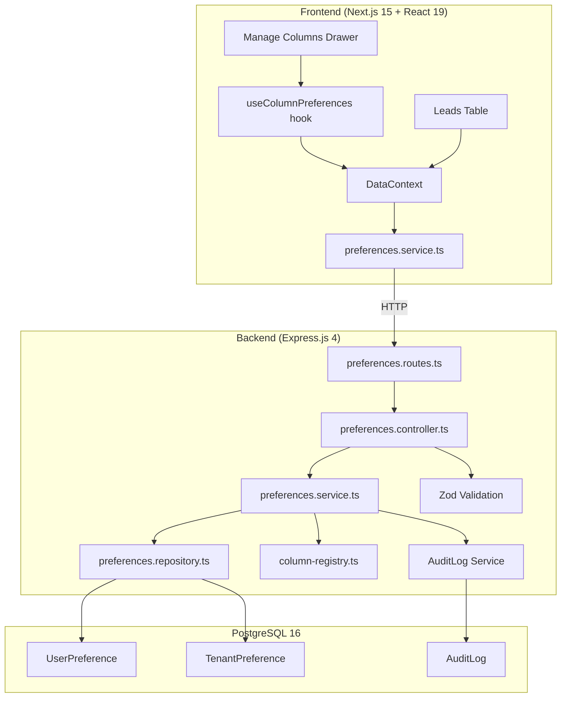
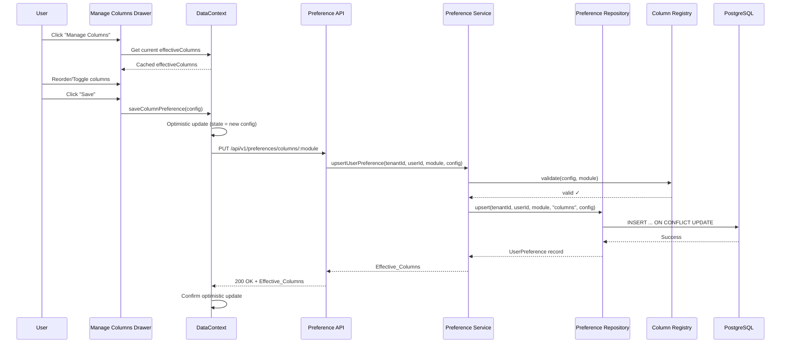
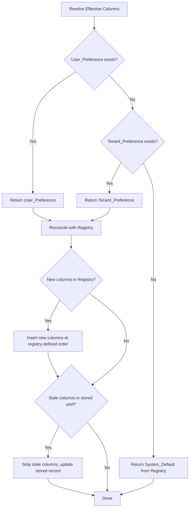

# Design Document: Manage Columns Persistence

## Overview

This design describes a server-persisted column configuration system for the LeadCRM Leads table (and future modules). Users customize which columns are visible and their order via a "Manage Columns" drawer. Configurations persist to PostgreSQL through a layered resolution hierarchy: System Default → Tenant Default → User Override. The architecture follows existing LeadCRM patterns: Express layered backend (Route → Controller → Service → Repository), Prisma ORM, JWT-based multi-tenant isolation, and the DataContext-driven frontend state model.

### Key Design Decisions

1. **Full replacement, not per-column merge** — Each layer completely replaces the previous layer's column list. This avoids complex merge logic and makes behavior predictable.
2. **Generic preference tables** — `UserPreference` and `TenantPreference` use `module` + `key` fields for extensibility beyond columns (filters, sort, etc.) without schema changes.
3. **Server-side Column Registry** — A TypeScript registry file defines available columns per module, serving as the single source of truth for validation and defaults.
4. **Optimistic updates with rollback** — The frontend applies changes immediately for responsiveness, reverting on failure.
5. **Audit on admin changes only** — Only tenant-level preference changes are audited (per compliance); user preference changes are not.

## Architecture

### System Architecture Diagram



### Request Flow



### Resolution Hierarchy Flow



## Components and Interfaces

### Backend Components

#### 1. Column Registry (`backend/src/modules/preferences/column-registry.ts`)

```typescript
export interface ColumnDefinition {
  id: string;               // camelCase alphanumeric, max 64 chars
  label: string;            // max 128 chars
  required: boolean;        // cannot be hidden
  defaultVisible: boolean;  // initial visibility
  defaultOrder: number;     // non-negative integer
}

export interface ModuleRegistry {
  module: string;
  columns: ColumnDefinition[];
}

// Registry organized per-module
export const COLUMN_REGISTRIES: Record<string, ModuleRegistry>;

// Helper functions
export function getRegistryForModule(module: string): ModuleRegistry | undefined;
export function getSystemDefault(module: string): ColumnConfig;
export function getRequiredColumnIds(module: string): string[];
export function isValidModule(module: string): boolean;
```

#### 2. Preferences Controller (`backend/src/modules/preferences/preferences.controller.ts`)

```typescript
export class PreferencesController {
  getEffectiveColumns(req: Request, res: Response): Promise<void>;
  saveUserPreference(req: Request, res: Response): Promise<void>;
  deleteUserPreference(req: Request, res: Response): Promise<void>;
  saveTenantDefault(req: Request, res: Response): Promise<void>;
  deleteTenantDefault(req: Request, res: Response): Promise<void>;
}
```

#### 3. Preferences Service (`backend/src/modules/preferences/preferences.service.ts`)

```typescript
export class PreferencesService {
  resolveEffectiveColumns(tenantId: string, userId: string, module: string): Promise<ColumnConfig>;
  upsertUserPreference(tenantId: string, userId: string, module: string, config: ColumnConfig): Promise<ColumnConfig>;
  deleteUserPreference(tenantId: string, userId: string, module: string): Promise<ColumnConfig>;
  upsertTenantDefault(tenantId: string, userId: string, module: string, config: ColumnConfig, ipAddress?: string): Promise<ColumnConfig>;
  deleteTenantDefault(tenantId: string, userId: string, module: string, ipAddress?: string): Promise<ColumnConfig>;
  private reconcileWithRegistry(config: ColumnConfig, module: string): ColumnConfig;
  private validateAgainstRegistry(config: ColumnConfig, module: string): ValidationResult;
}
```

#### 4. Preferences Repository (`backend/src/modules/preferences/preferences.repository.ts`)

```typescript
export class PreferencesRepository {
  findUserPreference(tenantId: string, userId: string, module: string, key: string): Promise<UserPreference | null>;
  upsertUserPreference(tenantId: string, userId: string, module: string, key: string, value: Json): Promise<UserPreference>;
  deleteUserPreference(tenantId: string, userId: string, module: string, key: string): Promise<void>;
  findTenantPreference(tenantId: string, module: string, key: string): Promise<TenantPreference | null>;
  upsertTenantPreference(tenantId: string, module: string, key: string, value: Json): Promise<TenantPreference>;
  deleteTenantPreference(tenantId: string, module: string, key: string): Promise<void>;
}
```

#### 5. Routes (`backend/src/modules/preferences/preferences.routes.ts`)

```typescript
// All routes under /api/v1/preferences/columns
router.get('/:module',
  authenticate,
  validate(GetColumnsParamsSchema),
  preferencesController.getEffectiveColumns
);

router.put('/:module',
  authenticate,
  validate(SaveColumnsSchema),
  preferencesController.saveUserPreference
);

router.delete('/:module',
  authenticate,
  validate(GetColumnsParamsSchema),
  preferencesController.deleteUserPreference
);

router.put('/:module/tenant-default',
  authenticate,
  rbac('settings', 'canEdit'),
  validate(SaveColumnsSchema),
  preferencesController.saveTenantDefault
);

router.delete('/:module/tenant-default',
  authenticate,
  rbac('settings', 'canEdit'),
  validate(GetColumnsParamsSchema),
  preferencesController.deleteTenantDefault
);
```

### Frontend Components

#### 1. Manage Columns Drawer (`frontend/src/features/tenant/crm/leads/ui/manage-columns-drawer.tsx`)

```typescript
interface ManageColumnsDrawerProps {
  isOpen: boolean;
  onClose: () => void;
  module: string;
  registry: ColumnDefinition[];
  effectiveColumns: ColumnConfigItem[];
  onSave: (config: ColumnConfigItem[]) => Promise<void>;
  onReset: () => Promise<void>;
}
```

#### 2. useColumnPreferences Hook (`frontend/src/features/tenant/crm/leads/hooks/use-column-preferences.ts`)

```typescript
interface UseColumnPreferencesReturn {
  effectiveColumns: ColumnConfigItem[];
  isLoading: boolean;
  isSaving: boolean;
  saveError: string | null;
  saveColumns: (config: ColumnConfigItem[]) => Promise<void>;
  resetColumns: () => Promise<void>;
  retryCount: number;
}

export function useColumnPreferences(module: string): UseColumnPreferencesReturn;
```

#### 3. Preferences Service (`frontend/src/features/tenant/crm/leads/services/preferences.service.ts`)

```typescript
export const preferencesService = {
  getEffectiveColumns(module: string): Promise<ColumnConfig>;
  saveUserPreference(module: string, config: ColumnConfig): Promise<ColumnConfig>;
  deleteUserPreference(module: string): Promise<ColumnConfig>;
  saveTenantDefault(module: string, config: ColumnConfig): Promise<ColumnConfig>;
  deleteTenantDefault(module: string): Promise<ColumnConfig>;
};
```

### Shared Types (`shared/src/types/preferences.ts`)

```typescript
export interface ColumnConfigItem {
  id: string;
  visible: boolean;
  order: number;
}

export interface ColumnConfig {
  module: string;
  view?: string;
  columns: ColumnConfigItem[];
}

export interface ColumnDefinition {
  id: string;
  label: string;
  required: boolean;
  defaultVisible: boolean;
  defaultOrder: number;
}
```

## Data Models

### Prisma Schema Additions

```prisma
// ─────────────────────────────────────────────────────
// USER PREFERENCE (per-user, per-module, per-key)
// Generic preference storage for column configs, filters, sorts, etc.
// ─────────────────────────────────────────────────────
model UserPreference {
  id        String   @id @default(uuid())
  tenantId  String
  userId    String
  module    String   @db.VarChar(64)
  key       String   @db.VarChar(128)
  value     Json
  createdAt DateTime @default(now())
  updatedAt DateTime @updatedAt

  tenant Tenant @relation(fields: [tenantId], references: [id], onDelete: Cascade)
  user   User   @relation(fields: [userId], references: [id], onDelete: Cascade)

  @@unique([tenantId, userId, module, key])
  @@index([tenantId, module])
}

// ─────────────────────────────────────────────────────
// TENANT PREFERENCE (per-tenant, per-module, per-key)
// Tenant-level defaults managed by Client Admins.
// ─────────────────────────────────────────────────────
model TenantPreference {
  id        String   @id @default(uuid())
  tenantId  String
  module    String   @db.VarChar(64)
  key       String   @db.VarChar(128)
  value     Json
  createdAt DateTime @default(now())
  updatedAt DateTime @updatedAt

  tenant Tenant @relation(fields: [tenantId], references: [id], onDelete: Cascade)

  @@unique([tenantId, module, key])
  @@index([tenantId, module])
}
```

### Column Registry Data (Leads Module)

```typescript
export const LEADS_COLUMN_REGISTRY: ModuleRegistry = {
  module: 'leads',
  columns: [
    { id: 'firstName',       label: 'First Name',        required: true,  defaultVisible: true,  defaultOrder: 0 },
    { id: 'lastName',        label: 'Last Name',         required: true,  defaultVisible: true,  defaultOrder: 1 },
    { id: 'email',           label: 'Email',             required: false, defaultVisible: true,  defaultOrder: 2 },
    { id: 'phone',           label: 'Phone',             required: false, defaultVisible: true,  defaultOrder: 3 },
    { id: 'companyName',     label: 'Company',           required: false, defaultVisible: true,  defaultOrder: 4 },
    { id: 'status',          label: 'Status',            required: true,  defaultVisible: true,  defaultOrder: 5 },
    { id: 'source',          label: 'Source',            required: false, defaultVisible: true,  defaultOrder: 6 },
    { id: 'assignedUserId',  label: 'Assigned To',       required: false, defaultVisible: true,  defaultOrder: 7 },
    { id: 'productInterest', label: 'Product Interest',  required: false, defaultVisible: false, defaultOrder: 8 },
    { id: 'address',         label: 'Address',           required: false, defaultVisible: false, defaultOrder: 9 },
    { id: 'createdAt',       label: 'Created Date',      required: false, defaultVisible: true,  defaultOrder: 10 },
    { id: 'accountId',       label: 'Account',           required: false, defaultVisible: false, defaultOrder: 11 },
  ],
};
```

### Stored Value Shape (JSON in `value` field)

```json
{
  "columns": [
    { "id": "firstName", "visible": true, "order": 0 },
    { "id": "lastName", "visible": true, "order": 1 },
    { "id": "email", "visible": true, "order": 2 }
  ]
}
```

## API Endpoints

### Request/Response Schemas

#### GET `/api/v1/preferences/columns/:module`

**Response (200):**
```json
{
  "success": true,
  "data": {
    "module": "leads",
    "source": "user" | "tenant" | "system",
    "columns": [
      { "id": "firstName", "visible": true, "order": 0 },
      { "id": "lastName", "visible": true, "order": 1 }
    ]
  }
}
```

#### PUT `/api/v1/preferences/columns/:module`

**Request Body:**
```json
{
  "columns": [
    { "id": "firstName", "visible": true, "order": 0 },
    { "id": "lastName", "visible": true, "order": 1 },
    { "id": "email", "visible": false, "order": 2 }
  ]
}
```

**Response (200):**
```json
{
  "success": true,
  "data": {
    "module": "leads",
    "source": "user",
    "columns": [...]
  }
}
```

**Validation Error (400):**
```json
{
  "success": false,
  "error": {
    "code": "VALIDATION_ERROR",
    "message": "Column configuration validation failed",
    "details": [
      { "field": "columns[2].id", "reason": "Column 'unknownCol' not found in leads registry" },
      { "field": "columns[0].visible", "reason": "Column 'firstName' is required and cannot be hidden" }
    ]
  }
}
```

#### DELETE `/api/v1/preferences/columns/:module`

**Response (200):**
```json
{
  "success": true,
  "data": {
    "module": "leads",
    "source": "tenant" | "system",
    "columns": [...]
  }
}
```

#### PUT `/api/v1/preferences/columns/:module/tenant-default`

Same request/response shape as user PUT, requires `settings.canEdit` permission.

#### DELETE `/api/v1/preferences/columns/:module/tenant-default`

Same response shape as user DELETE, requires `settings.canEdit` permission.

### Zod Validation Schemas

```typescript
// Path params
export const ColumnModuleParamsSchema = z.object({
  module: z.string().min(1).max(50).regex(/^[a-z][a-z0-9_-]*$/),
});

// Column item in payload
const ColumnItemSchema = z.object({
  id: z.string().min(1).max(255).regex(/^[a-zA-Z0-9]+$/),
  visible: z.boolean(),
  order: z.number().int().nonneg(),
});

// Full save payload — max 64KB enforced at middleware level
export const SaveColumnsBodySchema = z.object({
  columns: z.array(ColumnItemSchema).min(1).max(100),
}).refine(
  (data) => new Set(data.columns.map(c => c.id)).size === data.columns.length,
  { message: 'Duplicate column ids are not allowed' }
);
```

## Correctness Properties

*A property is a characteristic or behavior that should hold true across all valid executions of a system — essentially, a formal statement about what the system should do. Properties serve as the bridge between human-readable specifications and machine-verifiable correctness guarantees.*

### Property 1: Resolution Hierarchy

*For any* combination of present/absent User_Preference and Tenant_Preference layers for a given module, the Preference_Service SHALL return the highest available layer (User > Tenant > System) as a complete replacement, never merging columns across layers.

**Validates: Requirements 1.1, 1.2, 1.3, 1.4, 16.1**

### Property 2: Registry Reconciliation

*For any* stored preference (User or Tenant) that is missing columns present in the current Column_Registry, the resolved Effective_Columns SHALL include every registry-defined column, with new columns inserted at their registry-defined default order and visibility.

**Validates: Requirements 1.5**

### Property 3: Required Column Visibility Enforcement

*For any* column configuration submitted to the Preference_API where a Required_Column has `visible: false`, the API SHALL reject the entire request and persist no changes.

**Validates: Requirements 5.2, 5.5**

### Property 4: Required Column Auto-Inclusion

*For any* column configuration that omits a Required_Column entirely, the Preference_Service SHALL include the omitted column with `visible: true` at its registry-defined default order in the Effective_Columns output.

**Validates: Requirements 5.3**

### Property 5: Unknown Column Rejection

*For any* column configuration containing a column id that does not exist in the Column_Registry for the specified module, the Preference_API SHALL reject the entire request with a validation error and persist no changes.

**Validates: Requirements 6.2, 15.3**

### Property 6: Stale Column Stripping

*For any* stored preference that references a column id no longer present in the Column_Registry, the resolved Effective_Columns SHALL exclude that column and the stored record SHALL be updated to remove it.

**Validates: Requirements 6.5**

### Property 7: Column ID Format Validation

*For any* column id string containing characters other than `[a-zA-Z0-9]` or exceeding 64 characters in length, the Preference_API SHALL reject the request with a validation error.

**Validates: Requirements 6.6, 15.6**

### Property 8: Search Filtering Correctness

*For any* column list and any search string, the Manage_Columns_Drawer's filtered result SHALL contain exactly those columns whose label includes the search string as a case-insensitive substring, preserving relative order.

**Validates: Requirements 8.3**

### Property 9: Optimistic Update Immediacy

*For any* column configuration save action, the DataContext SHALL update the effective columns state to the new configuration synchronously (within the same render cycle), before the API response is received.

**Validates: Requirements 9.1, 13.4**

### Property 10: Failure Rollback Integrity

*For any* save or reset operation that fails (network error, timeout, or HTTP error), the DataContext SHALL revert the effective columns state to exactly the configuration that was active immediately before the operation was initiated.

**Validates: Requirements 9.4, 10.4**

### Property 11: User Preference Independence

*For any* update to a Tenant_Preference, all existing User_Preference records for that tenant and module SHALL remain unchanged in the database.

**Validates: Requirements 4.5**

### Property 12: Duplicate Column Rejection

*For any* column configuration containing two or more entries with the same column id, the Preference_API SHALL reject the entire request with a validation error and persist no changes.

**Validates: Requirements 15.2**

### Property 13: Payload Constraint Validation

*For any* column configuration payload exceeding 64 KB, or containing an order value that is negative or exceeds the total column count in the registry, or containing more columns than defined in the registry for that module, the Preference_API SHALL reject the request.

**Validates: Requirements 15.1, 15.4, 15.5**

### Property 14: Visible Column Rendering

*For any* Effective_Columns configuration, the Leads table SHALL render exactly the columns where `visible === true`, in ascending order of their `order` field, and no other columns.

**Validates: Requirements 17.1**

### Property 15: Cache Authority

*For any* server response received after a fetch, the DataContext SHALL overwrite the cached Effective_Columns with the server response value, regardless of prior cached state.

**Validates: Requirements 2.5, 13.2**

## Error Handling

### Backend Error Strategy

| Scenario | HTTP Status | Error Code | Behavior |
|----------|-------------|------------|----------|
| Invalid/missing JWT | 401 | `UNAUTHORIZED` | No query executed |
| Non-admin on tenant-default endpoint | 404 | `NOT_FOUND` | Opaque denial |
| Invalid module parameter | 400 | `VALIDATION_ERROR` | Module not in registry |
| Invalid column configuration | 400 | `VALIDATION_ERROR` | Field-level error details |
| Payload > 64 KB | 400 | `PAYLOAD_TOO_LARGE` | Rejected before parsing |
| Cross-tenant access attempt | 404 | `NOT_FOUND` | Identical to genuine not-found |
| Database write failure | 500 | `INTERNAL_ERROR` | No partial writes, existing data unchanged |
| Corrupted stored preference | — | — | Skip layer, resolve from next layer |
| Audit log write failure | — | — | Complete preference mutation, log warning |

### Frontend Error Strategy

| Scenario | User Experience | Technical Behavior |
|----------|----------------|-------------------|
| Save failure | "Unable to save" + Retry button | Optimistic rollback, retry up to 3× |
| Reset failure | Error notification | Revert to pre-reset config |
| Initial fetch failure | Table renders System_Default | Retry on next navigation |
| Network timeout (>10s) | Same as save failure | AbortController cancellation |
| Drawer closed during in-flight save | No UI feedback | Continue request, rollback if fails |

### Error Response Shape

All API errors follow the existing LeadCRM error format:

```typescript
interface ApiErrorResponse {
  success: false;
  error: {
    code: string;
    message: string;
    details?: Array<{ field: string; reason: string }>;
  };
}
```

## Testing Strategy

### Property-Based Testing

This feature is suitable for property-based testing. The resolution hierarchy, validation logic, and column reconciliation are pure functions with clear input/output behavior that benefit from exhaustive input generation.

**Library:** fast-check (TypeScript)  
**Minimum iterations:** 100 per property  
**Tag format:** `Feature: manage-columns-persistence, Property {number}: {title}`

**PBT-Covered Properties:**
- Property 1: Resolution Hierarchy — generate random layer combinations
- Property 2: Registry Reconciliation — generate configs with missing columns
- Property 3: Required Column Enforcement — generate configs hiding required columns
- Property 4: Required Column Auto-Inclusion — generate configs omitting required columns
- Property 5: Unknown Column Rejection — generate configs with invalid ids
- Property 7: Column ID Format Validation — generate strings with special chars/length
- Property 8: Search Filtering — generate column lists and search strings
- Property 10: Failure Rollback — generate pre-save states and simulate failures
- Property 11: User Preference Independence — generate user prefs, mutate tenant pref
- Property 12: Duplicate Column Rejection — generate configs with duplicates
- Property 13: Payload Constraints — generate oversized/invalid payloads

### Unit Tests (Example-Based)

- Specific Leads module registry validation (correct columns defined)
- RBAC enforcement (admin vs non-admin on tenant-default endpoints)
- Auth rejection (missing/expired JWT)
- Idempotent delete (no record exists)
- localStorage migration (valid data, invalid JSON, unknown columns)
- Responsive column filtering at specific breakpoints
- Drawer UI states (loading, saving, saved, error, confirmation dialog)
- Focus trap and keyboard navigation

### Integration Tests

- Full API round-trip: save → retrieve → verify same config
- Cross-device persistence: save → new session → retrieve
- Tenant isolation: user A cannot read user B's preference in different tenant
- Cascade delete: deleting a User removes their preferences
- Audit trail: admin changes produce correct AuditLog entries
- Database atomicity: concurrent writes handled correctly
- Performance: p95 < 200ms for GET requests

### E2E Tests (Playwright)

- Open drawer → reorder columns → save → verify table updated
- Reset to default → verify table shows system/tenant defaults
- Multi-user scenario: admin sets tenant default, user overrides, another user sees tenant default
- Dark mode rendering of drawer
- Mobile responsive behavior
