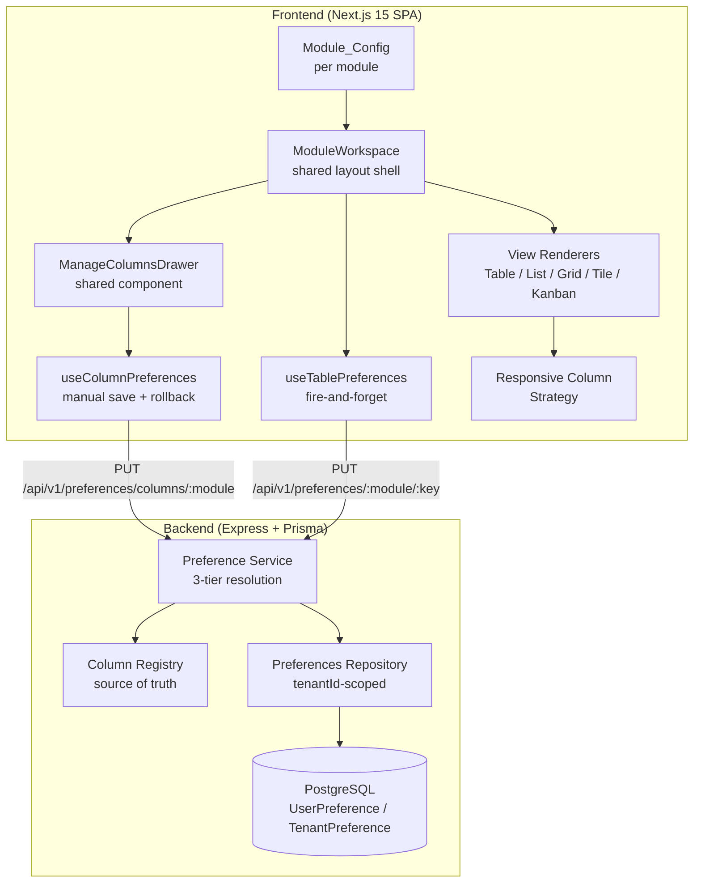
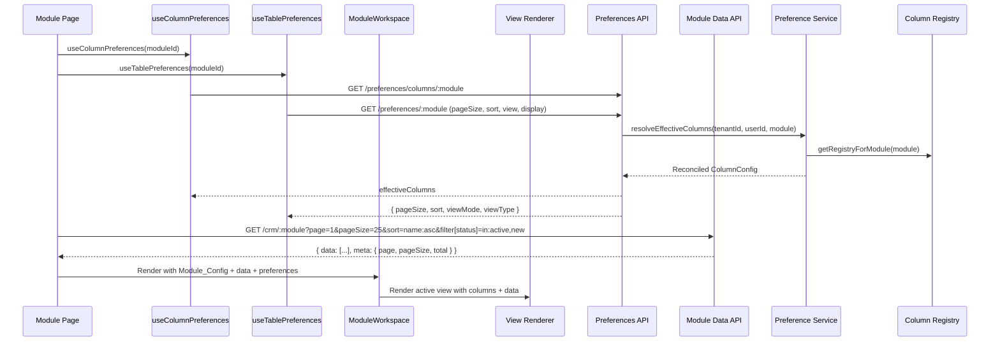
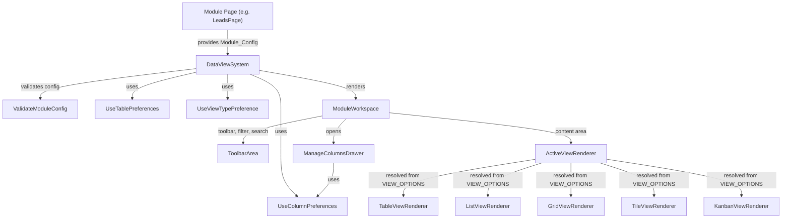

# Design Document: Unified Data Views

## Overview

The Unified Data Views system provides a reusable, declarative architecture for rendering CRM module data across multiple view types (Table, List, Grid, Tile, Kanban). Rather than each module implementing its own table/view infrastructure, modules provide a single `Module_Config` object that the Data_View_System uses to render consistent, feature-rich data views with server-persisted user preferences.

This design extends the existing Column Registry, Preference Service, ModuleWorkspace, ManageColumnsDrawer, useColumnPreferences, and useTablePreferences — adding the `priority` field, the Module_Config interface, a view renderer registry, responsive column strategy, and multi-view rendering without replacing any existing infrastructure.

### Key Design Decisions

1. **Extend, don't replace**: All new types and hooks build on top of the existing preference architecture. No new database models, no new API routes for core column preferences.
2. **Module_Config as the single entry point**: Each module declares one config object that drives the entire Data_View_System — columns, views, filters, actions, and sort fields.
3. **VIEW_OPTIONS registry pattern**: New view types are added by registering a component in a constant map — no conditional branches in core code.
4. **Priority-based responsive columns**: The new `priority` field on ColumnDefinition enables progressive column hiding at narrow viewports without user configuration.
5. **Fire-and-forget for transient preferences**: View type, sort, page size, and display mode use optimistic update + fire-and-forget persistence with toast-on-failure (no rollback). Column config uses manual save with rollback.
6. **Server-side pagination, sorting, and filtering**: All data fetching is server-driven. The API receives `page`, `pageSize`, `sort`, and `filter` parameters and returns only the current page of results. The frontend does NOT sort or filter locally on paginated results. Persisted sort/filter preferences are sent as query params on every data fetch.
7. **Column Registry single source of truth**: Backend `column-registry.ts` is the authority (validation/reconciliation). Frontend `column-registries.ts` is a read-only synchronized mirror (UI rendering). `ModuleConfig.columnRegistry` is a reference TO the frontend mirror — not an independent source.
8. **Preference state ownership**: `useColumnPreferences` is the SOLE owner of column preference state. `DataContext` does NOT manage column preferences. This separation is enforced by design.
9. **Selection is session state**: Row selection is frontend session state only, NOT persisted as a UserPreference. It resets on page navigation, filter change, and browser refresh.

---

## Architecture

### System Context Diagram



### Data Flow for Module Rendering



### Server-Side Pagination, Sorting, and Filtering

All data fetching is **server-driven**. The frontend NEVER sorts or filters locally on paginated results.

**Data Fetch Contract:**

```typescript
// Every module data fetch includes these query parameters:
interface ModuleDataFetchParams {
  page: number;         // Current page (1-based)
  pageSize: number;     // Records per page (10–50)
  sort?: string;        // Format: "field:direction" e.g. "name:asc", "createdAt:desc"
  filter?: FilterCondition[]; // Server-side filter conditions
  search?: string;      // Full-text search term
}

// API response always includes pagination meta:
interface PaginatedResponse<T> {
  success: true;
  data: T[];
  meta: {
    page: number;
    pageSize: number;
    total: number;
    totalPages: number;
  };
}
```

**Key Behaviors:**

1. The API receives `page`, `pageSize`, `sort`, and `filter` parameters and returns **only the current page** of data.
2. Changing sort, filter, or search triggers a **new API call** with `page` reset to 1.
3. Persisted sort/filter preferences are sent as query params on every data fetch — they control what the server returns, not local display.
4. **View switching does NOT trigger a new API call.** When the user switches views (e.g., table → grid), the currently-loaded page of data is reused. The view renderer simply re-renders the same dataset in a different layout.
5. Only pagination changes, sort changes, filter changes, and search changes trigger new API calls.

**Requirement 2 AC2 Clarification:** "Already-loaded dataset" in the context of view switching means the data for the **current page** already in memory. It does NOT mean the full dataset is preloaded. The system only holds one page of data at a time.

### Filter Operator Contract

The filter system uses an extensible operator contract that supports the current TrelloFilter multi-select pattern and future filter types:

```typescript
// shared/src/types/data-view.types.ts

export type FilterOperator =
  | 'equals'
  | 'contains'
  | 'in'
  | 'not_in'
  | 'gt'
  | 'lt'
  | 'gte'
  | 'lte'
  | 'between'
  | 'is_null'
  | 'is_not_null';

export interface FilterCondition {
  field: string;
  operator: FilterOperator;
  value: unknown; // Type depends on operator: string for 'equals'/'contains', string[] for 'in'/'not_in', [min, max] for 'between', null for 'is_null'/'is_not_null'
}
```

**Initial Implementation:** The current TrelloFilter multi-select component produces `{ field, operator: 'in', value: string[] }` conditions. This is the only operator used at launch, but the contract supports future extension without breaking changes.

**URL Serialization:** Filters are serialized to URL query params for shareability:
```
?filter[status]=in:active,new&filter[source]=in:website
```

**Server-Side Processing:** The backend receives filter conditions as query params and translates them to Prisma `where` clauses:
```typescript
// Example: filter[status]=in:active,new → { status: { in: ['active', 'new'] } }
```

---

## Components and Interfaces

### Module_Config Interface

```typescript
// shared/src/types/data-view.types.ts

import type { ColumnDefinition } from './preferences';

export type ViewType = 'table' | 'list' | 'grid' | 'tile' | 'kanban';

export type FilterOperator =
  | 'equals'
  | 'contains'
  | 'in'
  | 'not_in'
  | 'gt'
  | 'lt'
  | 'gte'
  | 'lte'
  | 'between'
  | 'is_null'
  | 'is_not_null';

export interface FilterCondition {
  field: string;
  operator: FilterOperator;
  value: unknown;
}

export interface SortableFieldDef {
  id: string;
  label: string;
}

export interface FilterItemDef {
  id: string;
  label: string;
}

export interface FilterGroupDef {
  id: string;
  label: string;
  items: FilterItemDef[];
}

export interface RowActionDef {
  id: string;
  label: string;
}

export interface BulkActionDef {
  id: string;
  label: string;
  destructive: boolean;
}

export interface ModuleConfig {
  /** Unique module identifier — must be non-empty and match COLUMN_REGISTRIES key */
  moduleId: string;
  /**
   * Reference to the module's Column_Registry definitions from the frontend mirror.
   * 
   * IMPORTANT — Column Registry Ownership:
   * - Backend `column-registry.ts` = AUTHORITY (validation, reconciliation, preference API)
   * - Frontend `column-registries.ts` = read-only synchronized mirror (UI rendering only)
   * - This property references the SAME array instance from the frontend mirror.
   *   It is NOT an independent copy or a third source of truth.
   * 
   * Usage: `columnRegistry: COLUMN_REGISTRIES.leads` (direct reference, not spread/copy)
   */
  columnRegistry: ColumnDefinition[];
  /** At least one view type must be declared */
  availableViews: [ViewType, ...ViewType[]];
  /** Fields available for sorting */
  sortableFields?: SortableFieldDef[];
  /** Filter groups for the filter rail */
  filterGroups?: FilterGroupDef[];
  /** Row-level actions (context menu / action column) */
  rowActions?: RowActionDef[];
  /** Bulk selection actions */
  bulkActions?: BulkActionDef[];
  /**
   * Column ID for Kanban grouping (optional).
   * Must reference a valid column ID in this module's columnRegistry.
   * At dev time, validateModuleConfig warns if kanbanGroupingField doesn't match any column ID.
   */
  kanbanGroupingField?: string;
}
```

### Column Registry Ownership Model

```
┌─────────────────────────────────────────────────────────────────┐
│  Backend: column-registry.ts                                     │
│  Role: AUTHORITY                                                 │
│  Used by: Preference Service validation, reconcileWithRegistry,  │
│           isValidModule, getSystemDefault, getRequiredColumnIds   │
└──────────────────────────────────┬──────────────────────────────┘
                                   │ synchronized (same commit)
                                   ▼
┌─────────────────────────────────────────────────────────────────┐
│  Frontend: column-registries.ts                                  │
│  Role: READ-ONLY MIRROR                                          │
│  Used by: UI rendering, responsive column strategy,              │
│           ManageColumnsDrawer display, view renderers             │
└──────────────────────────────────┬──────────────────────────────┘
                                   │ direct reference (same instance)
                                   ▼
┌─────────────────────────────────────────────────────────────────┐
│  ModuleConfig.columnRegistry                                     │
│  Role: REFERENCE to the frontend mirror                          │
│  NOT an independent source — points to the same array            │
└─────────────────────────────────────────────────────────────────┘
```

**Rules:**
1. Backend registry is never imported or referenced on the frontend — the mirror serves that role.
2. Frontend mirror must be updated in the same commit as any backend registry change.
3. ModuleConfig.columnRegistry should use direct reference (`COLUMN_REGISTRIES.leads`), not a spread/copy.
4. The backend registry is used for validation — if a user submits preference data referencing a column ID not in the backend registry, the preference API rejects it (HTTP 400).

### Extended ColumnDefinition (priority field)

```typescript
// shared/src/types/preferences.ts (additive change)

export type ColumnPriority = 'required' | 'high' | 'medium' | 'low';

export interface ColumnDefinition {
  id: string;
  label: string;
  required: boolean;
  defaultVisible: boolean;
  defaultOrder: number;
  group?: string;
  /** Responsive priority — determines hide order as viewport narrows */
  priority: ColumnPriority;
}
```

### VIEW_OPTIONS Registry

```typescript
// frontend/src/shared/components/crm/view-registry.ts

import type { ComponentType } from 'react';
import type { ViewType } from '@leadcrm/shared';

export interface ViewRendererProps {
  data: Record<string, unknown>[];
  columns: ColumnConfigItem[];
  columnRegistry: ColumnDefinition[];
  viewMode: ViewMode;
  onRowClick?: (recordId: string) => void;
  onRowSelect?: (recordId: string, selected: boolean) => void;
  selectedIds?: Set<string>;
  isLoading?: boolean;
}

export const VIEW_OPTIONS: Record<ViewType, ComponentType<ViewRendererProps>> = {
  table: TableViewRenderer,
  list: ListViewRenderer,
  grid: GridViewRenderer,
  tile: TileViewRenderer,
  kanban: KanbanViewRenderer,
};
```

### Module_Config Validation

```typescript
// frontend/src/shared/components/crm/validate-module-config.ts

export function validateModuleConfig(config: ModuleConfig): void {
  if (!config.moduleId || config.moduleId.trim() === '') {
    throw new Error('[Data_View_System] Module_Config rejected: moduleId is empty');
  }
  if (!config.columnRegistry || config.columnRegistry.length === 0) {
    throw new Error('[Data_View_System] Module_Config rejected: columnRegistry is empty');
  }
  if (!config.availableViews || config.availableViews.length === 0) {
    throw new Error('[Data_View_System] Module_Config rejected: availableViews is empty');
  }

  // Dev-time warning: validate kanbanGroupingField references a valid column ID
  if (config.kanbanGroupingField) {
    const columnIds = new Set(config.columnRegistry.map((col) => col.id));
    if (!columnIds.has(config.kanbanGroupingField)) {
      console.warn(
        `[Data_View_System] Module "${config.moduleId}": kanbanGroupingField ` +
        `"${config.kanbanGroupingField}" does not reference a valid column ID in the registry. ` +
        `Available IDs: ${[...columnIds].join(', ')}`
      );
    }
  }
}
```

### Invalid Module API Behavior

When the preference API receives a request for a module not present in `COLUMN_REGISTRIES`:

```typescript
// Backend: preferences.service.ts — isValidModule check
// GET/PUT/DELETE /api/v1/preferences/columns/:module

if (!isValidModule(module)) {
  throw new AppError('Not found', 404);
  // Returns HTTP 404 — aligns with cross-tenant 404 pattern.
  // Does NOT reveal whether the module exists or not.
}
```

**Decision:** HTTP 404 for unknown modules. This is the authoritative behavior for all preference API endpoints when the `:module` parameter does not match any key in `COLUMN_REGISTRIES`.

### Responsive Column Strategy

```typescript
// frontend/src/shared/hooks/use-responsive-columns.ts

import type { ColumnConfigItem, ColumnDefinition, ColumnPriority } from '@leadcrm/shared';

const PRIORITY_ORDER: ColumnPriority[] = ['low', 'medium', 'high', 'required'];

/**
 * Reserved widths for fixed UI elements that reduce available column space.
 * These are subtracted BEFORE computing how many data columns fit.
 */
const RESERVED_WIDTHS = {
  checkbox: 44,   // Selection column width (14px checkbox + padding)
  actions: 48,    // Row action column width (icon button + padding)
  scrollbar: 17,  // Estimated scrollbar width (Windows/macOS varies)
} as const;

/**
 * Computes which columns to show based on available container width.
 * 
 * Algorithm:
 * 1. Subtract reserved widths (checkbox, action column, scrollbar) from container width
 * 2. Required columns are ALWAYS shown — calculate their total width first
 * 3. Remaining space after required columns determines how many additional columns fit
 * 4. Additional columns are included in priority order (high → medium → low)
 * 5. If required columns alone exceed available width → enable horizontal scroll, never hide them
 */
export function computeVisibleColumns(
  columns: ColumnConfigItem[],
  registry: ColumnDefinition[],
  containerWidth: number,
  columnMinWidth: number = 120,
  options: { hasCheckbox?: boolean; hasActions?: boolean } = { hasCheckbox: true, hasActions: true },
): { visibleColumns: ColumnConfigItem[]; requiresHorizontalScroll: boolean } {
  // Step 1: Subtract reserved widths
  let availableWidth = containerWidth;
  if (options.hasCheckbox) availableWidth -= RESERVED_WIDTHS.checkbox;
  if (options.hasActions) availableWidth -= RESERVED_WIDTHS.actions;
  availableWidth -= RESERVED_WIDTHS.scrollbar;

  const visibleColumns = columns.filter((c) => c.visible);
  const registryMap = new Map(registry.map((r) => [r.id, r]));

  // Step 2: Separate required and non-required columns
  const requiredColumns = visibleColumns.filter(
    (c) => registryMap.get(c.id)?.priority === 'required'
  );
  const nonRequiredColumns = visibleColumns.filter(
    (c) => registryMap.get(c.id)?.priority !== 'required'
  );

  // Step 3: Calculate required column total width
  const requiredTotalWidth = requiredColumns.length * columnMinWidth;

  // Step 4: If required columns alone exceed available width → horizontal scroll
  if (requiredTotalWidth >= availableWidth) {
    return {
      visibleColumns: visibleColumns.sort((a, b) => a.order - b.order),
      requiresHorizontalScroll: true,
    };
  }

  // Step 5: Calculate remaining space for additional columns
  const remainingWidth = availableWidth - requiredTotalWidth;
  const maxAdditionalColumns = Math.floor(remainingWidth / columnMinWidth);

  // If all columns fit, no need to hide anything
  if (nonRequiredColumns.length <= maxAdditionalColumns) {
    return {
      visibleColumns: visibleColumns.sort((a, b) => a.order - b.order),
      requiresHorizontalScroll: false,
    };
  }

  // Step 6: Sort non-required by priority (high first, low last) and keep only what fits
  const sortedNonRequired = [...nonRequiredColumns].sort((a, b) => {
    const aPriority = registryMap.get(a.id)?.priority ?? 'low';
    const bPriority = registryMap.get(b.id)?.priority ?? 'low';
    return PRIORITY_ORDER.indexOf(bPriority) - PRIORITY_ORDER.indexOf(aPriority);
  });

  const kept = [...requiredColumns, ...sortedNonRequired.slice(0, maxAdditionalColumns)];
  return {
    visibleColumns: kept.sort((a, b) => a.order - b.order),
    requiresHorizontalScroll: false,
  };
}
```

### useViewTypePreference Hook

```typescript
// frontend/src/shared/hooks/use-view-type-preference.ts

import { useState, useCallback, useEffect, useRef } from 'react';
import { tablePreferencesApi } from '@/shared/services/table-preferences.api';
import { toast } from 'sonner';
import type { ViewType } from '@leadcrm/shared';

export function useViewTypePreference(module: string, defaultView: ViewType = 'table') {
  const [viewType, setViewTypeState] = useState<ViewType>(defaultView);
  const [isLoading, setIsLoading] = useState(true);
  const mountedRef = useRef(true);

  useEffect(() => {
    mountedRef.current = true;
    return () => { mountedRef.current = false; };
  }, []);

  useEffect(() => {
    let cancelled = false;
    async function fetch() {
      setIsLoading(true);
      try {
        const response = await tablePreferencesApi.getViewType(module);
        if (!cancelled && mountedRef.current) {
          setViewTypeState(response.data.viewType ?? defaultView);
        }
      } catch {
        // Keep default
      } finally {
        if (!cancelled && mountedRef.current) setIsLoading(false);
      }
    }
    fetch();
    return () => { cancelled = true; };
  }, [module, defaultView]);

  const setViewType = useCallback((view: ViewType) => {
    setViewTypeState(view);
    tablePreferencesApi.saveViewType(module, view).catch(() => {
      if (mountedRef.current) {
        toast.error('Unable to save view preference', { duration: 5000 });
      }
    });
  }, [module]);

  return { viewType, setViewType, isLoading };
}
```

### Component Hierarchy



### Preference State Ownership

**Explicit ownership boundaries to prevent confusion:**

| State | Owner | NOT owned by |
|---|---|---|
| Column visibility, order | `useColumnPreferences` hook | DataContext, ModuleWorkspace |
| Page size, sort, view mode, display | `useTablePreferences` hook | DataContext |
| View type | `useViewTypePreference` hook | DataContext |
| Filter selections | `useFilterUrlSync` hook + URL state | DataContext |
| Row selection | Local component state (`useState`) | DataContext, UserPreference |
| Module data (records) | DataContext / module data hook | useColumnPreferences |

**`useColumnPreferences` is the SOLE owner of column preference state.** DataContext does NOT manage, cache, or proxy column preferences. This is already the case in the codebase and must remain so.

**Rationale:** Column preferences are presentation concerns. They control which columns are visible and in what order. They do not affect data fetching, business logic, or authorization. Keeping them in a dedicated hook avoids coupling with the DataContext god object and simplifies testing.

### Selection State Scope

Row selection is **frontend session state only** — it is NOT persisted as a UserPreference.

```typescript
// Selection state lives in local component state:
const [selectedIds, setSelectedIds] = useState<Set<string>>(new Set());
```

**Selection resets on:**
- Page navigation (changing pages in pagination)
- Filter change (new filter conditions applied)
- Sort change (new sort applied — because server returns different page)
- Search change (new search term applied)
- Browser refresh (state is in-memory only)
- Module navigation (leaving and returning to module)

**Selection persists during:**
- View switching (table → grid → kanban — same data, different layout)
- Column preference changes (reorder, visibility toggle)
- Display mode changes (wrap/clip)

**Why not persist?** Selections are ephemeral action contexts. Users select records to perform a bulk action, then the selection is consumed. Persisting stale selections across sessions would create confusion and potential unintended bulk operations.

### View Switching Data Behavior

When the user switches view types (e.g., table → grid → kanban):

1. **No new API call is made.** The currently-loaded page of data is reused.
2. **Filter state, search term, and sort preference are preserved** — they remain in the URL and hook state.
3. **The view renderer simply re-renders the same dataset** in a different layout.
4. **Selection state is preserved** across view switches.

**What DOES trigger a new API call:**
- Pagination: changing pages (next/prev)
- Sort change: user picks a different sort field/direction
- Filter change: user adds/removes filter conditions
- Search change: user types a new search term
- Page size change: user selects a different page size (resets to page 1)

---

## Data Models

### Existing Models (no schema changes needed)

```prisma
model UserPreference {
  id        String   @id @default(uuid())
  tenantId  String
  userId    String
  module    String
  key       String   // "columns" | "pageSize" | "sort" | "view" | "display" | "filters"
  value     Json     // Stored as { columns: [...] } or { pageSize: 25 } etc.
  createdAt DateTime @default(now())
  updatedAt DateTime @updatedAt

  @@unique([tenantId, userId, module, key])
}

model TenantPreference {
  id        String   @id @default(uuid())
  tenantId  String
  module    String
  key       String
  value     Json
  createdAt DateTime @default(now())
  updatedAt DateTime @updatedAt

  @@unique([tenantId, module, key])
}
```

### Preference Key Scheme

| Preference | Key | Value Shape | Persist Strategy | Server-Side Usage |
|---|---|---|---|---|
| Column config | `columns` | `{ columns: ColumnConfigItem[] }` | Manual save (Save button) | UI display only |
| Page size | `pageSize` | `{ pageSize: number }` | Fire-and-forget | Sent as `pageSize` query param on data fetch |
| Sort | `sort` | `{ field: string, direction: 'asc'\|'desc' } \| null` | Fire-and-forget | Sent as `sort=field:direction` query param on data fetch |
| View type | `view` | `{ viewType: ViewType }` | Fire-and-forget | Frontend-only (determines which renderer to use) |
| Display mode | `display` | `{ viewMode: 'wrap'\|'clip' }` | Fire-and-forget | Frontend-only (determines text truncation) |
| Filters | `filters` | `{ conditions: FilterCondition[] }` | Fire-and-forget | Sent as `filter[field]=operator:value` query params on data fetch |

**Sort and filter preferences serve dual roles:**
1. They are **persisted** to UserPreference so users see their last configuration on return.
2. They are **sent as query parameters** on every data fetch to the module's API endpoint.

The frontend does NOT apply sort or filter logic locally. It sends them to the server and renders whatever the server returns.

### Preference Resolution Hierarchy

```
User Preference (tenantId + userId + module + key)
  ↓ not found or corrupted
Tenant Default (tenantId + module + key)
  ↓ not found or corrupted
System Default (from Column_Registry / code constants)
```

Each layer is a full replacement — no per-field merge between layers.

### Priority Field Migration

The `priority` field is added to the `ColumnDefinition` interface in `shared/src/types/preferences.ts`. All four existing module registries (leads, contacts, accounts, deals) in both backend and frontend are updated in the same commit. The mapping rule:

- `required: true` → `priority: 'required'`
- Name/title columns → `priority: 'high'`
- Status, commonly-visible columns → `priority: 'medium'`
- Communication, optional detail columns → `priority: 'low'`

---

## Correctness Properties

*A property is a characteristic or behavior that should hold true across all valid executions of a system — essentially, a formal statement about what the system should do. Properties serve as the bridge between human-readable specifications and machine-verifiable correctness guarantees.*

### Property 1: Module_Config Validation

*For any* Module_Config object, the Data_View_System SHALL accept it if and only if the moduleId is a non-empty string, the columnRegistry contains at least 1 item, and availableViews contains at least 1 view type. Any Module_Config violating these constraints SHALL be rejected with an error identifying the invalid field.

**Validates: Requirements 1.1, 1.6**

### Property 2: View Type Filtering

*For any* Module_Config with a declared set of availableViews, the view switcher SHALL render selectable options for exactly those view types — no more, no less.

**Validates: Requirements 1.4, 2.6**

### Property 3: State Preservation Across View Switches

*For any* active filter state, search term, and sort preference, switching from one view type to another SHALL preserve all three values unchanged.

**Validates: Requirements 2.2**

### Property 4: Required Columns Never Hidden

*For any* set of columns where some have `priority: 'required'`, regardless of viewport width, container width, or user configuration, required columns SHALL always remain visible. Non-required columns SHALL be hidden in priority order (low → medium → high) as space decreases. If required columns alone exceed the available container width (after subtracting reserved widths for checkbox ~44px, action column ~48px, and scrollbar ~17px), horizontal scrolling SHALL be enabled rather than hiding any required column.

**Validates: Requirements 4.3, 4.4, 4.6, 5.3, 7.2**

### Property 5: Sequential Order Assignment After Reorder

*For any* column list of length N, after a drag-and-drop reorder operation completes, the resulting order values SHALL be the consecutive integers 0, 1, 2, ..., N-1 assigned in visual position order.

**Validates: Requirements 5.2**

### Property 6: Preference Resolution Hierarchy

*For any* combination of User Preference, Tenant Default, and System Default states (present, absent, or corrupted), the resolution SHALL always return a valid ColumnConfig by selecting the highest-priority non-corrupted layer. If all stored layers are corrupted, the System Default from the Column Registry SHALL be returned.

**Validates: Requirements 6.7, 16.3**

### Property 7: Registry Reconciliation Correctness

*For any* stored ColumnConfig and any Column_Registry state, reconciliation SHALL: (a) remove all column IDs not present in the current registry, (b) insert all registry columns missing from the config at their default position and visibility, and (c) force `visible: true` on all columns whose registry entry has `required: true`.

**Validates: Requirements 6.10, 16.5**

### Property 8: Pagination Reset on Context Change

*For any* current pagination state, when page size, filter selection, or search term changes, the current page SHALL reset to 1.

**Validates: Requirements 10.2, 10.6**

### Property 9: Pagination Boundary Controls

*For any* total record count and page size, the previous-page button SHALL be disabled when current page is 1, and the next-page button SHALL be disabled when the current page is the last page (ceil(total / pageSize)).

**Validates: Requirements 10.4, 10.5, 10.7**

### Property 10: Tenant Isolation of Preferences

*For any* preference read or write operation, the tenantId used for scoping SHALL be derived exclusively from the authenticated JWT payload — never from request body, query parameters, or URL path segments.

**Validates: Requirements 12.1**

### Property 11: Invalid Column IDs Rejected

*For any* column configuration submitted for persistence that contains one or more column IDs not present in the target module's Column_Registry, the Preference_Service SHALL reject the request with HTTP 400 and SHALL NOT persist any partial configuration.

**Validates: Requirements 12.4, 11.6**

### Property 12: Selection Cap at 100

*For any* selection state, the total number of selected records SHALL never exceed 100. Any attempt to select beyond 100 (individually or via select-all) SHALL leave the selection at exactly 100.

**Validates: Requirements 14.1, 14.2**

### Property 13: Serialization Round-Trip

*For any* valid ColumnConfig object (conforming to the SaveColumnsBodySchema), serializing to JSON and deserializing back SHALL produce a result that is deep-equal to the original — all field values identical in type and value.

**Validates: Requirements 16.1**

### Property 14: Preference Storage Validation

*For any* deserialized preference value, validation against SaveColumnsBodySchema SHALL return null (without throwing) for any value that fails schema parsing, and SHALL accept any valid value containing at most 100 column items.

**Validates: Requirements 16.2, 16.4**

---

## Error Handling

### Error Categories and Strategies

| Scenario | Strategy | User Feedback |
|---|---|---|
| Module_Config validation failure | Throw at component init, caught by Error Boundary | Error boundary message identifying missing field |
| Invalid kanbanGroupingField in Module_Config | console.warn at dev time (non-fatal) | Browser console warning only |
| Unknown module in preference API request | Return HTTP 404 (same as cross-tenant pattern) | Frontend shows "not found" or falls back |
| Column preference fetch failure | Keep empty state, display system defaults | Toast notification (non-blocking) |
| Column save failure | Optimistic rollback to previous state | Inline error in ManageColumnsDrawer |
| Column save retry exhausted (3×) | Disable retry button | Inline error persists |
| Fire-and-forget persist failure (view, sort, pageSize, display) | Retain UI state, no rollback | Toast via sonner, auto-dismiss 5s |
| Preference API timeout (>5s) on initial load | Fall back to system defaults | Toast notification |
| Invalid column IDs in persist request | Reject entire request (HTTP 400) | Field-level error details returned |
| Stale columns in stored preference | Auto-reconcile via `reconcileWithRegistry` | Silent — no user notification |
| Data fetch failure | Show error state in content area | Retry button in content area |
| Bulk action partial failure | Continue processing remaining | Summary toast (N succeeded, M failed) |

### Error Boundary Placement

```
App Layout
└── Page Error Boundary (catches Module_Config validation errors)
    └── ModuleWorkspace
        └── Content Error Boundary (catches view renderer errors)
            └── Active View Renderer
```

### Toast Conventions

- **Error toast**: Red accent, 5s auto-dismiss, message describes what failed
- **Info toast**: Neutral, 3s auto-dismiss (e.g., selection cap reached)
- **Success toast**: Green accent, 3s auto-dismiss (e.g., bulk action complete)
- Library: sonner (already in stack)

---

## Testing Strategy

### Dual Testing Approach

This feature uses both unit/example-based tests and property-based tests for comprehensive coverage.

**Property-based testing library**: `fast-check` (already installed in the project, see `backend/package.json`)

**Configuration**: Minimum 100 iterations per property test.

**Tag format**: `Feature: unified-data-views, Property {number}: {property_text}`

### Property-Based Tests

Each correctness property (1–14) will have a corresponding property-based test:

| Property | Test Location | Generator Strategy |
|---|---|---|
| 1 — Module_Config validation | `shared/src/__tests__/module-config.property.test.ts` | Generate random configs with valid/invalid field combinations |
| 2 — View type filtering | `frontend/src/shared/__tests__/view-filtering.property.test.ts` | Generate random subsets of ViewType |
| 3 — State preservation | `frontend/src/shared/__tests__/view-switch.property.test.ts` | Generate random filter/search/sort states |
| 4 — Required columns never hidden | `frontend/src/shared/__tests__/responsive-columns.property.test.ts` | Generate column sets with mixed priorities, varying container widths, and checkbox/action column options. Verify required always visible, horizontal scroll when required exceed space after reserved widths. |
| 5 — Sequential order | `frontend/src/shared/__tests__/column-reorder.property.test.ts` | Generate random permutations of column lists |
| 6 — Preference hierarchy | `backend/src/modules/preferences/__tests__/preference-hierarchy.property.test.ts` | Generate random layer states (present/absent/corrupted) |
| 7 — Reconciliation | `backend/src/modules/preferences/__tests__/reconciliation.property.test.ts` | Generate stale configs + modified registries |
| 8 — Pagination reset | `frontend/src/shared/__tests__/pagination-reset.property.test.ts` | Generate random page states + change triggers |
| 9 — Pagination boundaries | `frontend/src/shared/__tests__/pagination-boundaries.property.test.ts` | Generate random totals and page sizes |
| 10 — Tenant isolation | `backend/src/modules/preferences/__tests__/tenant-isolation.property.test.ts` | Generate random tenant/user combinations |
| 11 — Invalid column rejection | `backend/src/modules/preferences/__tests__/column-validation.property.test.ts` | Generate configs with random invalid IDs |
| 12 — Selection cap | `frontend/src/shared/__tests__/selection-cap.property.test.ts` | Generate random selection sequences |
| 13 — Serialization round-trip | `backend/src/modules/preferences/__tests__/serialization-roundtrip.property.test.ts` | Generate random valid ColumnConfig objects |
| 14 — Storage validation | `backend/src/modules/preferences/__tests__/storage-validation.property.test.ts` | Generate random valid/invalid JSON structures |

### Unit / Example-Based Tests

| Area | Test Focus |
|---|---|
| ModuleWorkspace rendering | Verify toolbar, filter rail, view switcher render correctly |
| View Renderers | Snapshot tests for each view type with sample data |
| ManageColumnsDrawer | Drag-and-drop, search, required column lock, reset, unsaved changes dialog |
| Loading/Empty states | Each state (skeleton, empty filtered, empty total, error) renders correctly |
| Table layout consistency | CSS classes match spec (heights, colors, borders) |
| Pagination controls | Correct label format, button states at boundaries |
| Bulk selection | Select-all, clear, destructive confirmation dialog |
| Keyboard accessibility | @dnd-kit keyboard sensor interactions |

### Integration Tests

| Area | Test Focus |
|---|---|
| Preference API round-trip | Save → fetch → verify on fresh session |
| Cross-device persistence | Save on one client, verify on another |
| Fire-and-forget error path | Mock API failure, verify toast shown, UI retained |
| RBAC enforcement | Verify 404 for unauthorized module access |
| Invalid module ID | Verify 404 returned for unknown module in preference API |
| Tenant default audit log | Verify audit entries written on tenant default changes |
| Server-side sort/filter | Verify data fetch includes sort/filter as query params, not applied locally |
| View switch no-fetch | Verify switching views does NOT trigger a new data API call |
| Filter condition serialization | Verify FilterCondition serialized to correct URL query format |
| Selection reset on data change | Verify selection clears on page/filter/sort/search change |

### Test Runner Configuration

- Runner: `vitest` (already configured)
- PBT library: `fast-check` (already installed)
- Frontend tests: `@testing-library/react` + `jsdom`
- Backend tests: Direct function calls with mocked Prisma
- Minimum property iterations: 100
